<div align="center">
<h3>ドローンエンジニア養成塾 デベロッパーコース</h3>
<h2>BlueOS アプリ開発ガイド</h2><br>
(WSL2 + SITL → BlueOS Extension 開発)<br/>
Ver.2.0.0 - 2026.6.30
</div>

Table of Contents
<!-- @import "[TOC]" {cmd="toc" depthFrom=1 depthTo=6 orderedList=false} -->

<!-- code_chunk_output -->

- [1. 事前準備](#1-事前準備)
  - [1.1. 最新資材の取得](#11-最新資材の取得)
  - [1.2. AIコーディングエージェントの準備](#12-aiコーディングエージェントの準備)
- [2. WSL/Pymavlink 応用編 ― Web アプリ開発](#2-wslpymavlink-応用編--web-アプリ開発)
  - [2.1. Web 制御アプリを生成する（Vibe コーディング）](#21-web-制御アプリを生成するvibe-コーディング)
  - [2.2. ローカル SITL で動作確認する](#22-ローカル-sitl-で動作確認する)
- [3. BlueOS 基礎編](#3-blueos-基礎編)
  - [3.1. 接続 ― 環境構築のおさらい](#31-接続--環境構築のおさらい)
  - [3.2. MAVLink Server ― エンドポイント追加と接続確認](#32-mavlink-server--エンドポイント追加と接続確認)
  - [3.3. MAVLink2REST ― curl で確認](#33-mavlink2rest--curl-で確認)
  - [3.4. Cockpit ― ARM・離陸・GOTO の確認](#34-cockpit--arm離陸goto-の確認)
- [4. BlueOS Extension 編](#4-blueos-extension-編)
  - [4.1. Web アプリを Extension 化（`/dronify-blueos`）](#41-web-アプリを-extension-化dronify-blueos)
  - [4.2. BlueOS への配布（build / push / install）](#42-blueos-への配布build--push--install)
- [5. 次の一手](#5-次の一手)
  - [5.1. 機能を追加する](#51-機能を追加する)
  - [5.2. ランディさんの Extension を読む](#52-ランディさんの-extension-を読む)
  - [5.3. 発展課題 ― 他デバイス連携](#53-発展課題--他デバイス連携)
- [6. Appendix ― 参考リンク](#6-appendix--参考リンク)

<!-- /code_chunk_output -->

<div style="page-break-before:always"></div>

# 1. 事前準備

本ガイドは、WSL 上の SITL で動作確認した Web アプリを、そのまま **BlueOS Extension** として Raspberry Pi 上で動かすまでを扱う実習ガイドです。

```
応用編 ― WSL + SITL で Web アプリを動かす
   ↓
基礎編 ― BlueOS の各サービスへの接続を確認する
   ↓
Extension 編 ― Agent Skill で Extension 化し、配布する
   ↓
次の一手 ― 機能を足し、他者の実装を読む
```

> **前提となる環境構築**
> 本ガイドを始める前に、下記2つの環境構築ガイドを完了しておいてください。本ガイドではこれらの内容（pymavlink 基礎・BlueOS の概要・実機接続）は既習として扱います。
> - **[ドローン開発環境構築手順書](../drone-dev-env-setup-guide/drone-dev-env-setup-guide.md)** … WSL2 + ArduPilot SITL + pymavlink + Docker
> - **[BlueOS 環境構築手順書](../drone-dev-env-setup-guide/blueos-dev-env-setup-guide.md)** … Raspberry Pi + BlueOS + SITL 接続

完了済みであること：

| チェック | 内容 |
|--------|------|
| ☐ | WSL2 (Ubuntu22.04) で SITL が起動できる |
| ☐ | WSL に Docker がインストール済み（[WSL Docker セットアップ手順](../drone-dev-env-setup-guide/wsl-docker-setup-guide.md)） |
| ☐ | `droneschool` リポジトリをフォーク＆クローン済み・ワークブランチ作成済み（[環境構築手順書 9.4](../drone-dev-env-setup-guide/drone-dev-env-setup-guide.md#94-課題提出用githubリポジトリ準備)） |
| ☐ | Raspberry Pi で BlueOS が起動し、SITL を Manual ボードに接続できる（[BlueOS 環境構築手順書](../drone-dev-env-setup-guide/blueos-dev-env-setup-guide.md)） |

## 1.1. 最新資材の取得

本ガイドで使う教材は `droneschool` リポジトリの master に収録されています。

- `webapp-blueos/` … Web アプリの完成版（素版 / BlueOS 版）と生成プロンプト
- `.claude/skills/dronify-blueos/` … Web アプリを BlueOS Extension 化する Agent Skill

これらは後から master に追加されたため、[環境構築手順書 9.4](../drone-dev-env-setup-guide/drone-dev-env-setup-guide.md#94-課題提出用githubリポジトリ準備) で作成した自分のワークブランチには含まれていません。作業前に master を取り込んでください。

> **手順:** フォーク元（master）の変更の取り込み方は **[最新の master を取り込む手順](../git-github-guide/fetch-latest-from-master.md)** を参照してください。

取り込めたか確認（両方が存在すれば OK）：

```bash
cd ~/GitHub/droneschool
ls webapp-blueos/ .claude/skills/dronify-blueos/
```

## 1.2. AIコーディングエージェントの準備

応用編の Web アプリ生成（第2部）と Extension 化（第4部）は、ターミナルで動く **AI コーディングエージェント** で進めます。下記のいずれか（CLI 版。IDE 拡張ではありません）を **WSL（Ubuntu）にインストール**してください。

| エージェント | 料金 | インストール手順 |
|---|---|---|
| **Claude Code**（推奨） | 有償 | https://code.claude.com/docs/ja/quickstart#step-1-install-claude-code |
| **Codex**（推奨） | 有償 | https://developers.openai.com/codex/cli#cli-setup |
| **GitHub Copilot CLI** | — | https://docs.github.com/ja/copilot/how-tos/copilot-cli/set-up-copilot-cli/install-copilot-cli |

> **インストール先は WSL（Ubuntu）です。** Windows 側ではなく、SITL や `droneschool` リポジトリと同じ WSL 環境にインストールしてください。
>
> Extension 化で使う `/dronify-blueos` は Claude Code の **Agent Skill**（`/コマンド` で起動）です。Codex / GitHub Copilot CLI では、`.claude/skills/dronify-blueos/SKILL.md` の内容を**プロンプトとして渡して**同じ手順を実行してください。

<div style="page-break-before:always"></div>

# 2. WSL/Pymavlink 応用編 ― Web アプリ開発

**目的:** pymavlink の操作（既習）を、ブラウザから使える Web 制御アプリへ発展させる。ここでは**仕様と技術スタックを与えて AI に生成させ**、ローカル SITL で動かすところまでを行う。

| 層 | 技術 |
|---|---|
| バックエンド | Python / FastAPI / pymavlink |
| リアルタイム通信 | WebSocket |
| フロントエンド | HTML / JavaScript ＋ Leaflet（地図） |

**機能仕様**

- 表示：接続状態・ARM 状態・フライトモード・GPS 座標・高度（リアルタイム）
- 地図：機体の現在位置と航跡
- 操作：ARM / TAKEOFF（高度指定）/ LAND / GoTo（緯度・経度・高度）/ モード変更

> **演習では完成版を使います（3分クッキング）。** アプリの生成（2.1）は宿題です。演習時間中は完成・素版 **`webapp-blueos/drone-web-app/`** をそのまま使って、ローカル動作確認（2.2）を行います。

## 2.1. Web 制御アプリを生成する（Vibe コーディング）

上記の仕様＋技術スタックは、生成用プロンプト **`webapp-blueos/build-prompt.md`** にまとまっています。これを自分のワークフォルダにコピーし、AI コーディングエージェントにそのプロンプトで指示してアプリ（以後 **Drone Web Control**）を生成します。

ワークフォルダ `~/GitHub/droneschool/workshop/<term_no>/<fname-lname>/` は、[環境構築手順書 9.4](../drone-dev-env-setup-guide/drone-dev-env-setup-guide.md#94-課題提出用githubリポジトリ準備) で作成済みである前提です。

```bash
# ① ワークフォルダの存在を確認し、生成プロンプトをコピー
cd ~/GitHub/droneschool/workshop/<term_no>/<fname-lname>   # 無ければ環境構築手順書 9.4 で作成
cp ~/GitHub/droneschool/webapp-blueos/build-prompt.md ./
```

```bash
# ② ワークフォルダで AI コーディングエージェントを起動し、build-prompt.md で指示する
cd ~/GitHub/droneschool/workshop/<term_no>/<fname-lname>
claude        # または codex / copilot（CLI 版）
# → 「build-prompt.md の指示に従ってアプリを生成して」と依頼する
```

> `build-prompt.md` は冒頭でアプリ名（既定 `drone-web-app`）と作成先パス（未指定ならプロンプトのある場所）を確定させます。生成されるアプリは `<ワークフォルダ>/drone-web-app/` 配下になります。
>
> このアプリは第4部で **そのまま Docker 化・BlueOS Extension 化**します。BlueOS で動かすための要件は `/dronify-blueos` が適用するので、ここでは「ローカルで動く Web アプリ」を作ることに集中します。

## 2.2. ローカル SITL で動作確認する

```bash
# ① SITL（tcp:5762 を自動で開く）
sim_vehicle.py -v Copter --console -L Kawachi
```

```bash
# ② アプリ起動（接続先をローカル SITL に上書き）
#    演習: 完成版 webapp-blueos/drone-web-app / 宿題: 自分が生成したアプリ
cd ~/GitHub/droneschool/webapp-blueos/drone-web-app/backend
MAV_ENDPOINT=tcp:127.0.0.1:5762 uvicorn main:app --host 0.0.0.0 --port 9999
```

ブラウザで <http://localhost:9999/> を開き、地図・テレメトリ・操作ボタンが動くことを確認します。

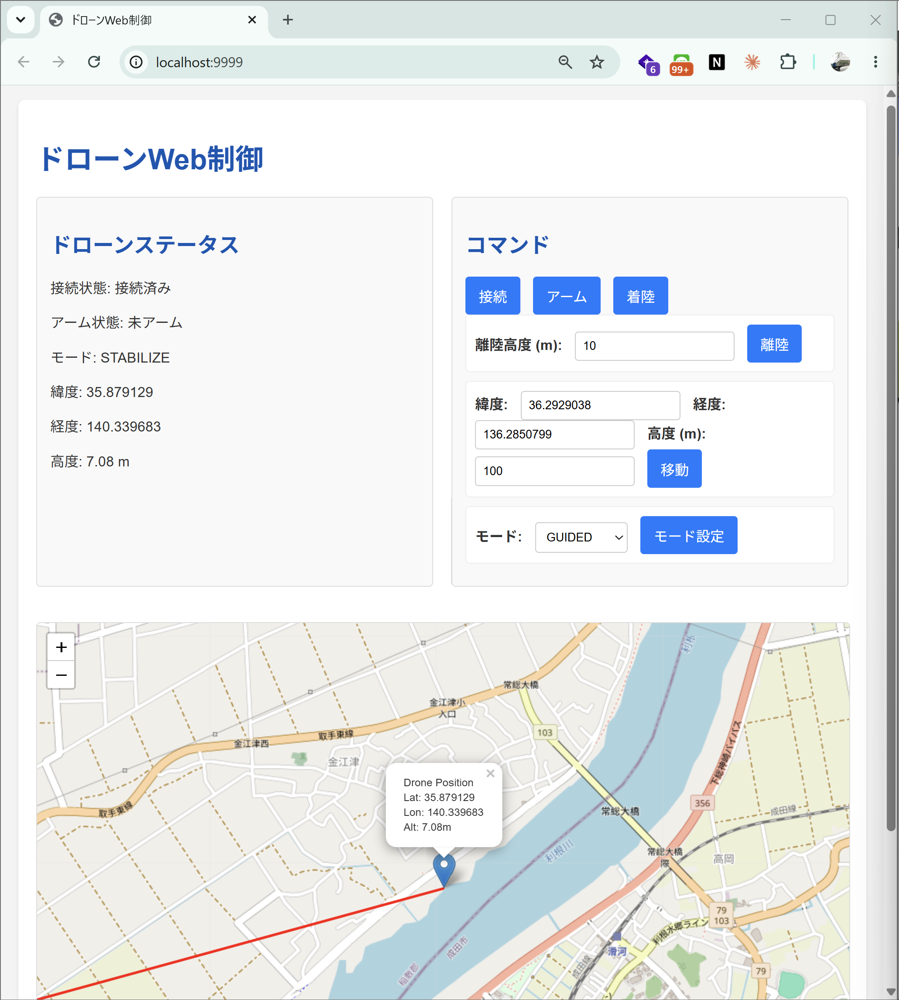

> 接続先は環境変数 `MAV_ENDPOINT` で切り替えます。未指定だと BlueOS 用の既定値（`udpout:host.docker.internal:14550`）になるため、ローカルでは `tcp:127.0.0.1:5762` を明示します。**同じコード・同じイメージのまま、接続先だけを差し替えて** WSL→BlueOS を移行できるのがポイントです。

**成果物:** ローカル SITL で地図・テレメトリ・操作ができる Web アプリ

<div style="page-break-before:always"></div>

# 3. BlueOS 基礎編

**目的:** Extension を載せる前に、BlueOS が各クライアントへ MAVLink をどう配るかを確認する。BlueOS 環境構築手順書で構築した「外部 SITL → Manual ボード」構成の上で進める。

```
WSL (Ubuntu) ── UDP 14551 ──→ 192.168.42.1:14551
                                    │
Raspberry Pi (BlueOS)  IP: 192.168.42.1
  ArduPilot Manager → Manual ボード（外部 SITL を受信）
  MAVLink Server（複数のエンドポイントを公開）
        ├─→ UDP Server 14550 → Mission Planner / Cockpit（GCS・3.4）／Extension（内部・host.docker.internal:14550・第4部）
        └─→ MAVLink2REST（ポート 6040・3.3）
```

> 3.2 では、エンドポイントの追加操作を体験するために一時的に `UDP Server 14552` を作って Mission Planner をつなぎ、最後に削除します。以降の手順では上図のとおり既定の `UDP Server 14550` を共有して使います。

## 3.1. 接続 ― 環境構築のおさらい

接続構成は [BlueOS 環境構築手順書](../drone-dev-env-setup-guide/blueos-dev-env-setup-guide.md) で構築済みです。ここでは下記チェックポイントだけ確認します（詳細手順は環境構築手順書を参照）。

| チェック | 内容 | 参照 |
|--------|------|------|
| ☐ | BlueOS が起動し、PC がホットスポット（`192.168.42.1`）に接続済み | 環境構築手順書 §2 |
| ☐ | Manual ボード設定済み（Master Endpoint: UDP Server `0.0.0.0:14551`） | 環境構築手順書 §3 |
| ☐ | WSL 上の SITL が起動済み（`sim_vehicle.py -v ArduCopter -L Kawachi --out udp:192.168.42.1:14551`） | 環境構築手順書 §3 |

## 3.2. MAVLink Server ― エンドポイント追加と接続確認

BlueOS の **MAVLink Server** は、フライトコントローラー（または外部 SITL）の MAVLink を複数のクライアントへ同時配信（ルーティング）するサービスです。Web UI 上は **MAVLink Endpoints** として設定します。ここでは **新しいエンドポイント（UDP Server 14552）を追加し、そこへ Mission Planner を接続できること**を確認します。

> 既定の `UDP Server 14550` は Cockpit（3.4）や Extension（第4部）が使うため、ここでは別ポート `14552` を新規に追加して「エンドポイントを増やす」操作を体験します。MAVLink Server は同じ機体のデータを複数エンドポイントへ同時配信できます。

**① エンドポイント一覧を開く**

1. ブラウザで <http://192.168.42.1>（BlueOS のホットスポット IP）を開く
2. 左メニュー → `MAVLink Endpoints`

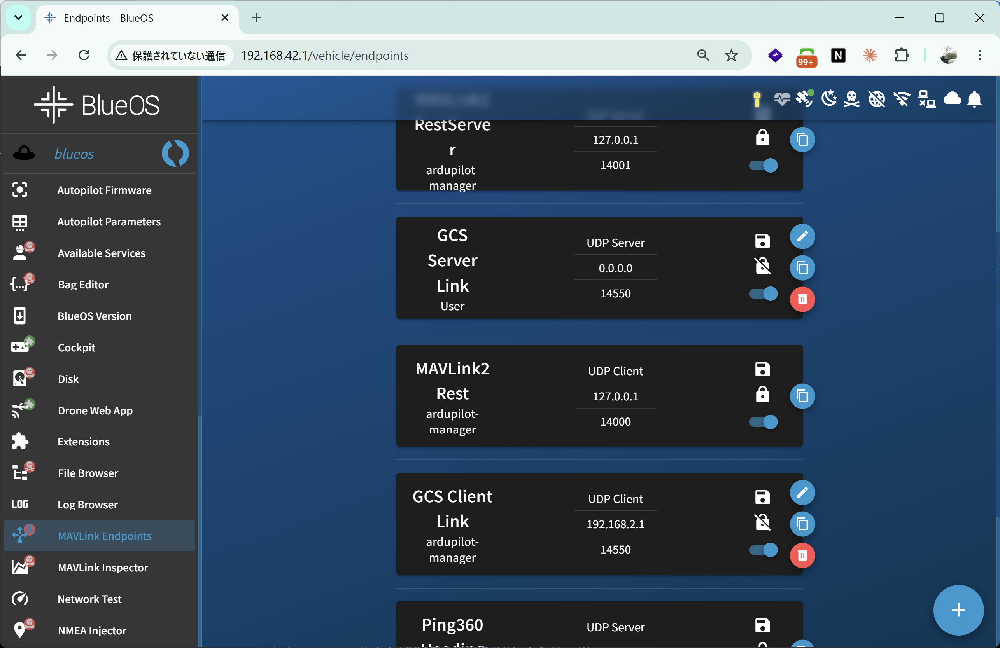

**② エンドポイントを追加する**

右下の `+` ボタンを押し、ダイアログに次の値を入力して `CREATE ENDPOINT` を押す。

| 項目 | 値 |
|-----|-----|
| Name | 任意（例: `My UDP Server_14552`） |
| Type | `UDP Server` |
| IP/Device | `0.0.0.0` |
| Port/Baudrate | `14552` |
| Start endpoint already enabled | ✅ チェック |

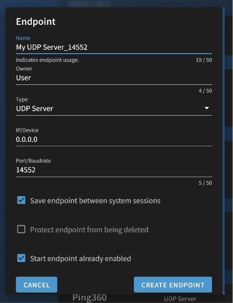

追加すると、一覧の先頭に `UDP Server 0.0.0.0:14552` が有効状態で表示される。

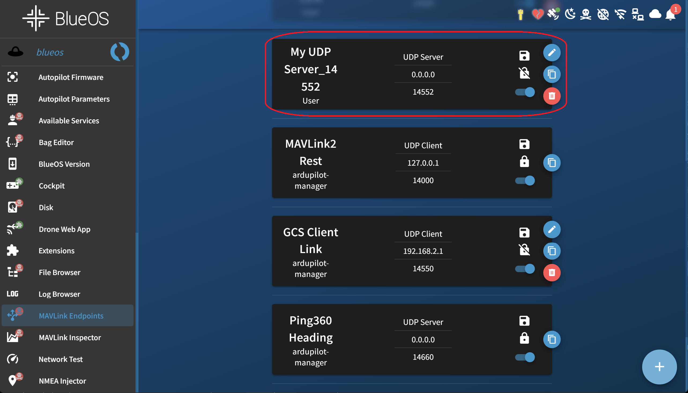

**③ Mission Planner から UDPCl 接続する**

1. PC を BlueOS のホットスポット（`192.168.42.1`）に接続する
2. Mission Planner 右上の接続種別で **`UDPCl`（UDP Client）** を選ぶ
3. `接続` を押し、接続先を入力する

   | 項目 | 値 |
   |-----|-----|
   | Host | `192.168.42.1` |
   | Port | `14552` |

4. HUD に姿勢・GPS・高度が表示され、`リンク ステータス` に機体（例: `UDPCl14552-1-QUADROTOR`）が出れば成功

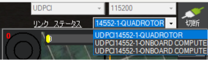

**④ Disable でエンドポイントを止めてみる**

エンドポイントは右側のトグルで有効/無効を切り替えられます。`My UDP Server_14552` のトグルを **Disable**（無効）にすると、そのエンドポイントへの配信が止まり、**Mission Planner の接続も切れます**（HUD が `No Link` 等になる）。エンドポイントが MAVLink の出口そのものであることを体感できます。確認したらトグルを戻して再び有効化します。

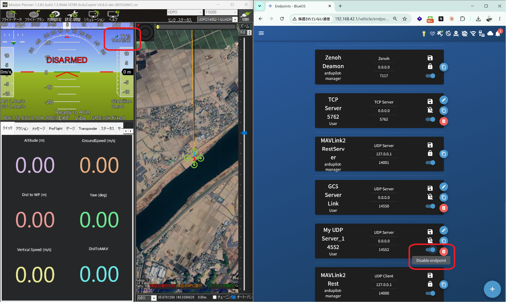

**⑤ 14552 のエンドポイントを削除する（後始末）**

この演習用に追加した `My UDP Server_14552` は、以降では使いません。エンドポイント右側の **ゴミ箱アイコン**で削除しておきます（Mission Planner も切断します）。

> **以降の手順では既定の `UDP Server 14550` を使います。** Cockpit（3.4）や Extension（第4部）はこの 14550 を共有して接続します。14550 が一覧に無い場合は、②と同じ手順で `UDP Server 0.0.0.0:14550` を追加してください。

**成果物:** エンドポイントの追加・接続・無効化・削除を通じて、MAVLink Server の配信のしくみを理解する

## 3.3. MAVLink2REST ― curl で確認

**MAVLink2REST**（ポート 6040）は、MAVLink メッセージを REST API（JSON）として読み書きできるサービスです。ブラウザやスクリプトから手軽にテレメトリを取得できます。

```bash
# 高度（GLOBAL_POSITION_INT）を取得
curl http://192.168.42.1/mavlink2rest/mavlink/vehicles/1/components/1/messages/GLOBAL_POSITION_INT
```

JSON が返れば疎通 OK です。

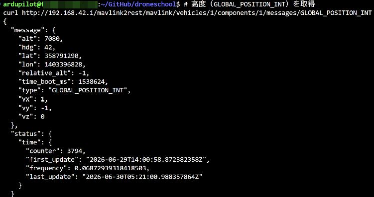

**主要エンドポイント**

| エンドポイント | 説明 |
|--------------|------|
| `.../vehicles` | 接続中の機体一覧 |
| `.../vehicles/1/components/1/messages` | 全メッセージ一覧 |
| `.../messages/HEARTBEAT` | HEARTBEAT |
| `.../messages/GLOBAL_POSITION_INT` | GPS 位置・高度 |
| `.../messages/SYS_STATUS` | バッテリー等 |

**Swagger UI で API を試す**

ブラウザで <http://192.168.42.1:6040/docs/index.html?url=/docs.json> を開くと、Swagger UI で全 API を一覧でき、ブラウザ上から直接リクエストを試せます。

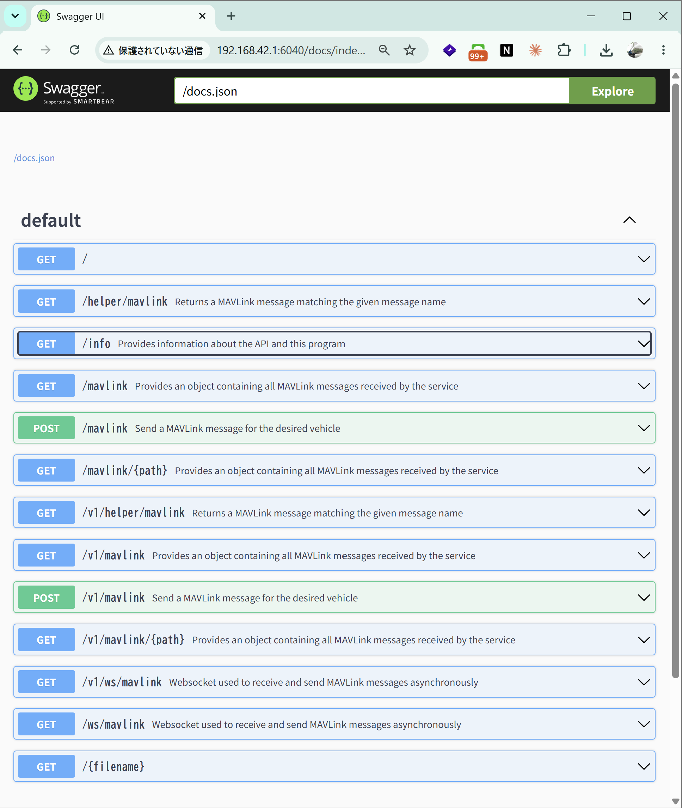

各エンドポイントを開き、`Try it out` を押してから `Execute` を押すと、リクエスト URL とレスポンス（JSON）が確認できます。

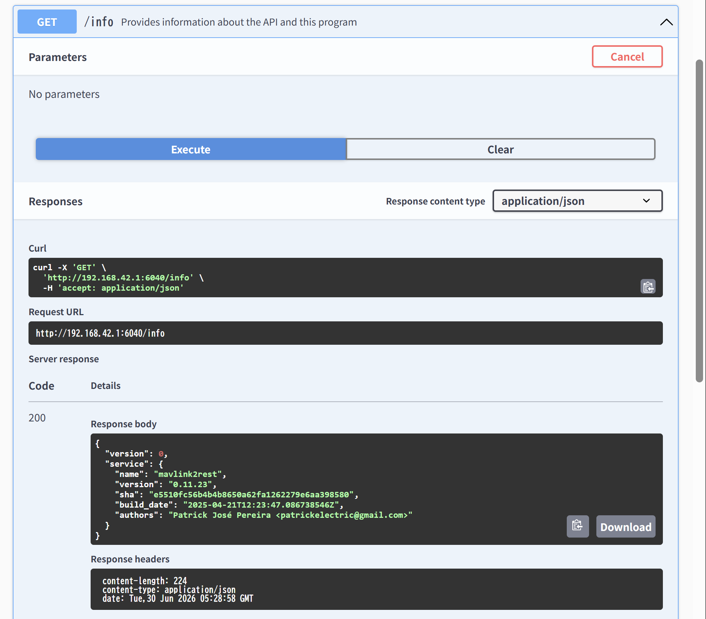

**成果物:** curl と Swagger UI で MAVLink2REST から応答を得る

## 3.4. Cockpit ― ARM・離陸・GOTO の確認

**Cockpit** は BlueOS に統合された Web ベースの GCS（地上局）です。Mission Planner を使わずに、ブラウザだけで機体の監視・操作ができます。ここで SITL に対して基本操作が通ることを確認します。

1. BlueOS 左メニューから **Cockpit** を開く（接続確認手順は [環境構築手順書 §4.4](../drone-dev-env-setup-guide/blueos-dev-env-setup-guide.md#44-cockpitからのgcs接続確認任意) を参照）
2. テレメトリ（姿勢・GPS・高度）が表示されることを確認する
3. 以下の基本操作が通ることを確認する：
   - **ARM** … アーム
   - **TAKEOFF** … 高度を指定して離陸（GUIDED に入る）
   - **GOTO** … 地図上の地点を指定して移動

> 🖼️ **TODO（画像）**: Cockpit で SITL に接続し、ARM・離陸・GOTO を実行している画面

> Cockpit / Mission Planner はいずれも MAVLink Server（`192.168.42.1:14550`）に GCS として接続します。第4部で作る Extension も同じ MAVLink Server に内部から接続するため、ここで操作が通れば Extension からも同じ操作が通ります。

**成果物:** Cockpit から SITL を ARM・離陸・GOTO できることを確認

<div style="page-break-before:always"></div>

# 4. BlueOS Extension 編

**目的:** 第2部で作った Web アプリを **BlueOS Extension 化**し、BlueOS の左メニューから開けるように配布する。**アプリのロジックは変えず**、BlueOS で動かすための要件を満たすことが中心。

**全体像**

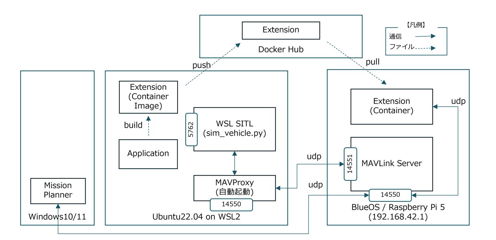

第4部の流れは、大きく「**作る → 配る → 動かす**」の3段階です。

- **作る（WSL／4.1）** … WSL 上でアプリ（Application）を `/dronify-blueos` で Extension 化し、Docker イメージ（Extension Container Image）に **build** する。動作確認は WSL SITL（`sim_vehicle.py`・ポート 5762）に対して行う。
- **配る（4.2 前半）** … build したイメージを **Docker Hub へ push** する。BlueOS は Docker Hub から **pull** してインストールする。
- **動かす（4.2 後半）** … BlueOS 上の Extension（Container）が、内部の **MAVLink Server（UDP Server 14550）** に `host.docker.internal:14550` で接続する。第3部で確認したとおり、外部 SITL は WSL の MAVProxy（14550）から BlueOS（14551）へ送られ、Mission Planner などの GCS は BlueOS の 14550 経由で監視する。

> 図のとおり、**同じアプリが「WSL では SITL（5762）」「BlueOS では MAVLink Server（14550）」に接続**します。接続先は環境変数 `MAV_ENDPOINT` で切り替わるだけで、コードもイメージも共通です（第2部 2.2 参照）。

## 4.1. Web アプリを Extension 化（`/dronify-blueos`）

AI が生成しただけのアプリでは、BlueOS 固有の要件が**満たされません**。本講座の中核がこの要件であり、Agent Skill **[`/dronify-blueos`](https://github.com/hfujikawa77/droneschool/blob/master/.claude/skills/dronify-blueos/SKILL.md)** がこれらを一問一答で確定 → 自動適用 → ローカルビルド検証まで行います（**Docker 化と Extension 化をまとめて適用**）。配布（build / push / install）は 4.2 で自分で行います。

> スキルの詳細仕様は [`SKILL.md`](https://github.com/hfujikawa77/droneschool/blob/master/.claude/skills/dronify-blueos/SKILL.md) を参照してください。

> **演習では完成版を使います（3分クッキング）。** `/dronify-blueos` の実行は宿題です。演習時間中は、すでに要件適用済みの完成・BlueOS版 **`webapp-blueos/drone-web-app-blueos/`** を使って、コンテナのビルド・起動を確認します（下記「ローカル確認」）。

**`/dronify-blueos` が適用する要件**

*Docker 化*

- **`Dockerfile`**：`python:3.11-slim` ベースで backend / frontend をコピーし、ポート **9999** で uvicorn 起動。`--no-access-log`（Helper の継続ヘルスチェックでログ肥大 → VIEW LOGS タイムアウトを防ぐ）
- **`.dockerignore`**：イメージ最小化

*Extension 化*

| # | 要件 | なぜ必要か |
|---|------|-----------|
| ① | **permissions LABEL（bridge + ポート固定）** | Kraken は LABEL を Docker API 設定としてそのまま使う。`avoid_iframes` で `http://<IP>:9999/` を直接開くためポートは固定（`HostPort:"9999"`） |
| ② | **`/register_service`（`avoid_iframes: true`）** | Helper はこの JSON で左メニューを生成。WebSocket は nginx 自動ルートが WS 非対応のため、直接ポートを開かせる |
| ③ | **`GET /` が 200 を返す** | Helper は `/` で生存確認。200 以外だと `/register_service` を呼ばずメニューに出ない |
| ④ | **MAVLink 接続（bridge / MAVLink Server 対策）** | `host.docker.internal` 接続・非ブロック接続・`mode_mapping_byname` での明示マップ・自機のみ受信（mode/armed の点滅防止） |
| ⑤ | **Leaflet をローカル同梱** | BlueOS ホットスポット接続中はネットに出られず CDN 不達（`L is not defined`） |

> **モードマップの落とし穴:** Plane の `GUIDED=15` を Copter に送ると Copter ではモード 15 が **AUTOTUNE** になり「Mode change to Autotune failed」になります（Copter は `GUIDED=4`）。これが `mode_mapping_byname` を使う理由です。
>
> **ポート:** **9999** で統一します（8080 は BlueOS 内の `mavlink-server` が使用済みのため避ける）。

**`/dronify-blueos` の実行（宿題）**

第2部で生成したアプリに対して、ワークフォルダでスキルを実行します。

```bash
cd ~/GitHub/droneschool/workshop/<term_no>/<fname-lname>/drone-web-app
claude        # Claude Code を起動
# → /dronify-blueos を実行（アプリ名・ポート・機体種別などの一問一答に答える）
```

> **`/dronify-blueos` が使える理由:** このスキルは `droneschool/.claude/skills/dronify-blueos/` にあります。ワークフォルダが droneschool リポジトリの**中**にあれば、Claude Code が親ディレクトリを辿ってスキルを検出するため、コピー不要でそのまま使えます。droneschool の外に作ると検出されないので注意してください。
>
> Codex / GitHub Copilot CLI は `.claude/skills/` を読みません。その場合は `.claude/skills/dronify-blueos/SKILL.md` の内容をプロンプトとして渡してください。
>
> スキルは要件の適用と **ローカルビルド検証**（`GET /` が 200、`/register_service` の JSON、`permissions` LABEL の確認）まで行います。**push と BlueOS インストールは行いません**（4.2 で自分で実施）。

**ローカル確認（完成版で確認）**

演習では、すでに要件が適用済みの完成・BlueOS版 **`webapp-blueos/drone-web-app-blueos/`** を使って、コンテナ起動を確認します（スキル適用は宿題）。

```bash
# ① SITL
sim_vehicle.py -v Copter --console -L Kawachi
```

```bash
# ② ビルド & 起動（接続先をローカル SITL に上書き）
cd ~/GitHub/droneschool/webapp-blueos/drone-web-app-blueos
docker build -t drone-web-app .
docker run --rm --network host -e MAV_ENDPOINT=tcp:127.0.0.1:5762 drone-web-app
# → ブラウザ http://localhost:9999/
```

> **`--network host` と `-e MAV_ENDPOINT`:** ローカルでは host ネットワークで SITL に直結し、接続先を `tcp:5762` へ明示します。BlueOS（4.2）では env を渡さず、既定の `host.docker.internal` で MAVLink Server に繋ぎます。

> 🖼️ **TODO（画像）**: コンテナ起動ログ、または `docker run` 後にブラウザで開いた <http://localhost:9999/> の画面

**成果物:** 要件適用済み・ローカル検証済みの Extension イメージ

## 4.2. BlueOS への配布（build / push / install）

ここは `/dronify-blueos` が行わない**手作業の配布フェーズ**です。マルチアーキ build → Docker Hub へ push → BlueOS にインストール、までを各自で行います。

**Docker Hub へのイメージ公開**

BlueOS は Docker Hub からイメージを pull するため、事前に公開しておきます。Raspberry Pi は arm64 のため、`docker buildx` で **マルチアーキ**ビルドして push します。

```bash
docker login
docker buildx create --use            # 初回のみ
# push 時に "blob upload unknown" が出たら --provenance=false を付けて再実行
docker buildx build --platform linux/amd64,linux/arm64 --provenance=false \
  -t <username>/drone-web-app:latest --push .
```

`https://hub.docker.com/r/<username>/drone-web-app` でイメージ（amd64/arm64）を確認します。

**BlueOS へのインストール（Web UI）**

1. `http://<BlueOS_IP>` → 左メニュー `Extensions` → `INSTALLED` タブ
2. 右下の `+` → `Create from scratch`
3. 以下を入力する

   | 項目 | 値 |
   |-----|-----|
   | Extension Identifier | `<username>.drone-web-control` |
   | Extension Name | `Drone Web Control` |
   | Docker image | `<username>/drone-web-app` |
   | Docker tag | `latest` |

   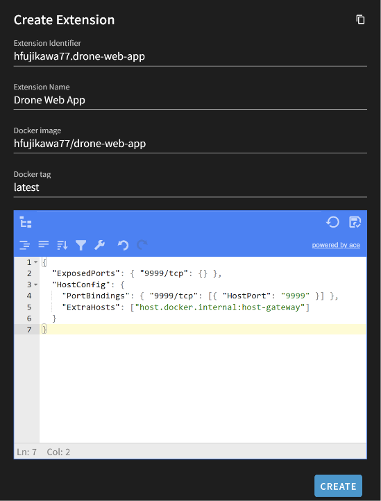

4. 下部の JSON エディタ（初期値 `{}`）に、4.1 ①の `permissions` と同じ内容を入力する

   ```json
   {
     "ExposedPorts": { "9999/tcp": {} },
     "HostConfig": {
       "PortBindings": { "9999/tcp": [{ "HostPort": "9999" }] },
       "ExtraHosts": ["host.docker.internal:host-gateway"]
     }
   }
   ```

   > **重要:** `Create from scratch` ではこの JSON エディタの内容が **LABEL より優先**されます（内部的に `user_permissions` として扱われ、LABEL は読まれない）。`{}` のままだとポートがマップされず**メニューに出ません**。必ず入力してください。

5. `CREATE` を押下

インストール後、左メニューに **Drone Web Control** が追加されます。詳細画面で Status が `Up` になっていれば起動成功。クリックすると `avoid_iframes` により **`http://<BlueOS_IP>:9999/` が新規ウィンドウで開きます**。

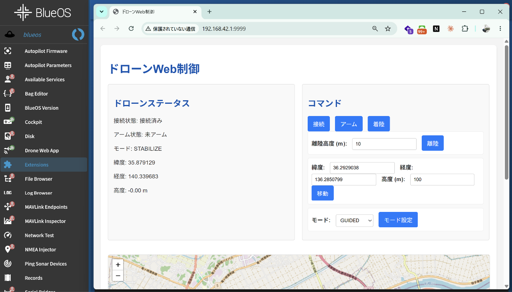

**動作確認（Definition of Done）**

- [ ] 左メニューに **Drone Web Control** が出る／クリックで `:9999` が開く
- [ ] ステータス（接続/ARM/モード/座標/高度）が**点滅せず安定**して表示
- [ ] ARM / TAKEOFF / LAND / GoTo / モード変更が機能（TAKEOFF で **GUIDED** に入る）
- [ ] オフラインでも地図ウィジェット・マーカー・航跡が描画（タイルは灰色で可）

**よくあるトラブル**

| 症状 | 原因 | 対策 |
|---|---|---|
| メニューに出ない | bridge/ポート未設定（JSONエディタ空）／`GET /` が 200 でない | 4.1 ①の permissions を JSON エディタに入力／4.1 ③で `/` が 200 を返す |
| TAKEOFF で AUTOTUNE 失敗 | Plane のモードマップを誤適用 | `mode_mapping_byname` で機体タイプから生成（4.1 ④） |
| ARM/モード表示が点滅 | GCS の HEARTBEAT も拾っている | 受信を自機（target）に限定（4.1 ④） |
| 地図が出ない | CDN（unpkg/OSM）に到達できない | Leaflet をローカル同梱（4.1 ⑤） |
| VIEW LOGS がタイムアウト | アクセスログ肥大 | `uvicorn ... --no-access-log`（4.1） |

**成果物:** BlueOS 左メニューから開ける Drone Web Control Extension

<div style="page-break-before:always"></div>

# 5. 次の一手

ここまでで「BlueOS の左メニューから開ける Extension」が完成しました。ここからは、作ったアプリを発展させる方向性を示します。いずれも必須ではなく、興味に応じて取り組んでください。

## 5.1. 機能を追加する

Drone Web Control に、表示情報や運用機能を足していきます。

- **表示情報の追加** … HUD（姿勢）、バッテリー残量、GPS 状況（fix・衛星数）などをパネルに追加
- **GOTO の強化** … 地図クリックで目的地指定、複数 WP の連続移動
- **Discord 通知** … イベント（離陸・着陸・モード変更・異常）を Discord へ通知
- **フェイルセーフ監視** … GPS 異常・バッテリー低下・EKF 異常・RC 喪失を検知して通知
- **実機での運用** … 同じ Extension を実機 FC で動かす（コードもイメージも無変更。SITL ボードを実機 FC に差し替えるだけ。手順は [BlueOS 環境構築手順書 §5.3](../drone-dev-env-setup-guide/blueos-dev-env-setup-guide.md#53-参考実機fcフライトコントローラーを接続する場合)）

**例：Discord 通知**

```python
import requests

DISCORD_WEBHOOK_URL = "https://discord.com/api/webhooks/<your-webhook-url>"

def notify(message: str):
    requests.post(DISCORD_WEBHOOK_URL, json={"content": message})

notify("バッテリー低下を検知しました！")
```

**例：フェイルセーフ監視スレッド**

```python
import threading
from pymavlink import mavutil

# Extension（コンテナ内）から MAVLink Server へ。4.1 と同じ接続先。
master = mavutil.mavlink_connection("udpout:host.docker.internal:14550")
master.wait_heartbeat()

BATTERY_THRESHOLD_V = 14.0  # 警告電圧 (V)

def monitor():
    while True:
        msg = master.recv_match(type=["GPS_RAW_INT", "SYS_STATUS"],
                                blocking=True, timeout=5)
        if msg is None:
            continue
        if msg.get_type() == "GPS_RAW_INT" and msg.fix_type < 3:
            notify("GPS 異常: Fix なし")
        if msg.get_type() == "SYS_STATUS":
            volt = msg.voltage_battery / 1000
            if volt < BATTERY_THRESHOLD_V:
                notify(f"バッテリー低下: {volt:.1f} V")

threading.Thread(target=monitor, daemon=True).start()
```

| 異常 | 検出方法 |
|-----|---------|
| GPS 異常 | `GPS_RAW_INT.fix_type < 3` |
| バッテリー低下 | `SYS_STATUS.voltage_battery < 閾値` |
| EKF 異常 | `EKF_STATUS_REPORT.flags` |
| RC 喪失 | `RC_CHANNELS.rssi == 0` |

## 5.2. ランディさんの Extension を読む

ArduPilot のコア開発者 Randy Mackay 氏（rmackay9）が公開している BlueOS Extension は、実用的な実装の好例です。自分の Extension に通じる構成（`register_service` / Docker LABEL / カメラ・MAVLink 連携）を読み解いてみましょう。

- **プレシジョンランディング** … <https://github.com/rmackay9/blueos-precision-landing>
- **高高度オプティカルフロー** … <https://github.com/rmackay9/blueos-opticalflow>
- **画像ダウンロード** … <https://github.com/rmackay9/blueos-camera-download>

> 同氏の他の Extension（`blueos-visual-follow`、`blueos-camera-gimbal-control`、`blueos-cloud-upload` など）も参考になります。一覧: <https://github.com/rmackay9?tab=repositories&q=blueos>

## 5.3. 発展課題 ― 他デバイス連携

Companion Computer の強みは、FC 単体では難しいセンサ・通信・AI 処理を載せられることです。Extension として下記のようなデバイス連携に挑戦できます。

- **他デバイス連携** … 3D カメラ、Lidar、カメラ、通信機器、距離センサ などを接続し、データ取得・可視化・機体制御へ反映する
- **AI 副操縦士** … 自然言語コマンドを MAVLink コマンドに変換するエージェント（例：「10mまで上昇して」→ GUIDED + TAKEOFF(10)）
- **AprilTag 追従** … カメラで AprilTag を検出し、ビジョンベースで機体を制御する
- **YOLO 物体検出** … 人物・車両を検出してアラートを送信する監視システム
- **複数機管理** … 複数の機体を同時に監視・制御するダッシュボード

<div style="page-break-before:always"></div>

# 6. Appendix ― 参考リンク

**BlueOS**
- 公式サイト: https://bluerobotics.com/blueos
- GitHub: https://github.com/bluerobotics/BlueOS
- Extension 開発ガイド: https://blueos.cloud/docs/stable/development/extensions/

**Cockpit**
- GitHub: https://github.com/bluerobotics/cockpit

**MAVLink2REST**
- GitHub: https://github.com/patrickelectric/mavlink2rest
- API ドキュメント: <http://192.168.42.1:6040/docs/index.html?url=/docs.json>

**pymavlink**
- GitHub: https://github.com/ArduPilot/pymavlink
- サンプルコード: https://www.ardusub.com/developers/pymavlink.html

**FastAPI**
- ドキュメント: https://fastapi.tiangolo.com/ja/

**Docker**
- 公式ドキュメント: https://docs.docker.com/
- Dockerfile リファレンス: https://docs.docker.com/engine/reference/builder/

**ArduPilot**
- MAVLink コマンド一覧: https://ardupilot.org/dev/docs/mavlink-commands.html
