<div align="center">
<h3>ドローンエンジニア養成塾 デベロッパーコース</h3>
<h2>コンパニオンコンピュータ（BlueOS）環境構築手順書</h2><br>
(Raspberry Pi 5 + BlueOS)<br/>
Ver.1.0.0 - 2026.6.12
</div>

<!--
Ver.1.0.0 - 2026.6.12 - 初版
-->

Table of Contents
<!-- @import "[TOC]" {cmd="toc" depthFrom=1 depthTo=6 orderedList=false} -->

<!-- code_chunk_output -->

- [1. はじめに](#1-はじめに)
  - [1.1. 実機導入の目的](#11-実機導入の目的)
  - [1.2. 本書の位置づけ](#12-本書の位置づけ)
  - [1.3. 前提事項](#13-前提事項)
- [2. ラズパイの初期セットアップ](#2-ラズパイの初期セットアップ)
  - [2.1. 事前準備](#21-事前準備)
  - [2.2. イメージのフラッシュ](#22-イメージのフラッシュ)
  - [2.3. 起動確認とセットアップ](#23-起動確認とセットアップ)
    - [2.3.1. 初回起動とホットスポット接続](#231-初回起動とホットスポット接続)
    - [2.3.2. セットアップウィザードの実行](#232-セットアップウィザードの実行)
    - [2.3.3. 接続確認](#233-接続確認)
  - [2.4. Pirate Modeの有効化](#24-pirate-modeの有効化)
  - [2.5. BlueOSのバージョン切り替え](#25-blueosのバージョン切り替え)
- [3. SITLの接続設定](#3-sitlの接続設定)
  - [3.1. Manualボードへの切り替え](#31-manualボードへの切り替え)
  - [3.2. WSL上のSITLの起動](#32-wsl上のsitlの起動)
- [4. 疎通確認](#4-疎通確認)
  - [4.1. MAVLink Inspectorでの確認](#41-mavlink-inspectorでの確認)
  - [4.2. Mission Plannerからの接続確認](#42-mission-plannerからの接続確認)
  - [4.3. 飛行動作の確認（任意）](#43-飛行動作の確認任意)
  - [4.4. CockpitからのGCS接続確認（任意）](#44-cockpitからのgcs接続確認任意)
- [5. Appendix](#5-appendix)
  - [5.1. BlueOS](#51-blueos)
  - [5.2. ArduPilot SITL](#52-ardupilot-sitl)
  - [5.3. Mission Planner](#53-mission-planner)
  - [5.4. Cockpit](#54-cockpit)

<!-- /code_chunk_output -->

<div style="page-break-before:always"></div>

# 1. はじめに
本書はArduPilotドローンアプリケーション開発用コンパニオンコンピュータ環境を構築する手順書です。  
コンパニオンコンピュータとしてRaspberry Pi 5（以下、ラズパイ）、OSイメージとしてBlueOSを使用します。

機体の代わりとしてWSL上のSITL（ArduPilotのシミュレータ）を使用し、ラズパイ上のBlueOSに機体として接続します。BlueOS内蔵のMAVLink Routerが、機体のテレメトリをPC上のGCS（Mission Planner）や開発アプリに配信します。  
本書で構築する環境の構成は下記の通りです。

```
Windows PC                                Raspberry Pi 5（BlueOS）
┌──────────────────────────┐             ┌──────────────────────────────┐
│ WSL2 + VS Code           │             │                              │
│   SITL（ArduCopter）──────┼─UDP:14551─▶│ MAVLink Router               │
│                          │             │   ├─（各クライアントへ配信）  │
│                          │             │   └─ Extension               │
│ Mission Planner（GCS）◀───┼─UDP:14550──│     （開発したアプリ）        │
└──────────────────────────┘             └──────────────────────────────┘
```
<!-- TODO: 構成図を画像に差し替え -->

## 1.1. 実機導入の目的
コンパニオンコンピュータ実機を導入することで座学習の理解をより一層深めることを第一の目的としています。  
- それぞれの技術要素、ソフト、ツールが実機のどこで利用されるのか。
- 実機ならではの問題に遭遇し、それの対処法を考える。
- アプリ開発⇔実機テストのサイクルをスムーズに行える。
- 卒業後でも継続して開発、運用のために活用できる。

## 1.2. 本書の位置づけ
本書のゴールは、**WSL上のSITLをBlueOSに機体として接続し、PC側のMission PlannerからBlueOS経由で機体に接続できること**を確認するところまでです。

SITLをWSL側で動かすことで、起動場所（ドローンフィールドKawachi）の指定やパラメータの変更が自由にできます。また、実機のフライトコントローラー（FC）を接続したときと同じ「機体 → BlueOS（MAVLink Router）→ クライアント」のデータフローのまま学習・開発ができます。

アプリ開発はすべてPC（WSL2）側で行い、ラズパイ上には開発環境を構築しません。  
BlueOSは「ホストOSには手を入れず、アプリはDockerコンテナ（Extension）として動かす」という設計思想のOSです。本書でもこの思想に沿って、ラズパイへのライブラリの直接インストールやVS Codeのリモート接続は行いません。

アプリの開発手順（pymavlinkによる開発、Docker化、BlueOS Extension化）は、別冊の**BlueOSアプリ開発ガイド**を参照してください。

※ トラブルシューティング等でラズパイ内のファイル確認やターミナル操作が必要な場合は、BlueOS管理画面の `File Browser` / `Terminal` をブラウザから利用できます。ただし `Terminal` で開くのはコンテナ内のシェルです。ホストOS側の操作が必要な場合はSSHでログインします（[2.3.3節](#233-接続確認)参照）。

## 1.3. 前提事項
デベロッパーコース向けの開発環境構築手順書（`drone-dev-env-setup-guide.pdf`）に則ってセットアップが完了している前提とします。  
下記を確認してください。
- Windows 10/11のPCにMission PlannerとVS Codeがインストールされていること
- WSL2（Ubuntu）にArduPilotのビルド環境がセットアップされ、SITL（`sim_vehicle.py`）の起動確認が完了していること
- WSL2にpymavlinkがインストールされていること

<div style="page-break-before:always"></div>


# 2. ラズパイの初期セットアップ
## 2.1. 事前準備
下記の機器を準備します。
1. Raspberry Pi 5 本体（8GB）
1. SDカード（32GB以上、A1クラス以上推奨）
1. USB-C ACアダプタ（5V/5A推奨）
1. SDカードリーダー（使用PCにSDカードスロットがない場合）

※ ラズパイはWiFi経由でインターネットに接続するため、LANケーブルは不要です。  
インターネットに接続できるWiFi（自宅のWiFiルーターやスマートフォンのテザリング等。以下「インターネット接続用WiFi」）を用意してください。  

※ PCの内蔵WiFiはラズパイのホットスポット接続に使用するため、作業中はPCからインターネットに接続できなくなります。PCも同時にインターネットへ接続したい場合は、**USB WiFiドングル（子機）** があると便利です（内蔵WiFiとドングルで、ホットスポット用とインターネット用を使い分けられます）。  

<div style="page-break-before:always"></div>

## 2.2. イメージのフラッシュ

下記WebサイトからRaspberry Pi Imagerをダウンロードしてインストールします。  
[https://www.raspberrypi.com/software/](https://www.raspberrypi.com/software/)

下記公式ドキュメントのインストールページを開いて、BlueOSのイメージをダウンロードします。  
[https://blueos.cloud/docs/stable/usage/installation/](https://blueos.cloud/docs/stable/usage/installation/)  

イメージ一覧テーブルから **`Raspberry Pi 5` / `ARMv8 (64-bit) Bookworm` / `Limited testing`** の行のダウンロードリンクをクリックしてイメージを取得します。  
※ ダウンロードには時間がかかる場合があります。

Raspberry Pi Imagerを使って、SDカードにBlueOSのイメージをフラッシュします。
1. SDカードをPCまたはSDカードリーダーに挿します。
1. Raspberry Pi Imagerを起動します。
1. `OSを選ぶ` ボタンをクリックし、一番下の `カスタムイメージを使う` を選択します。
1. ダウンロードしたBlueOSのイメージファイル（`.img` または `.img.gz`）を選択します。
1. `ストレージを選ぶ` ボタンでSDカードドライブを選択します。（くれぐれもPCのメインドライブを選択しないように!!!）
1. `書き込む` ボタンでフラッシュを開始します。
1. フラッシュ完了後の確認メッセージが表示されたら完了です。

## 2.3. 起動確認とセットアップ

BlueOSは起動後、インターネット接続用WiFiへの接続とホットスポット（PC接続用）を**同時に動作**させます。  
セットアップ完了後の構成は下記の通りです。

```
インターネット接続用WiFi ── RPi5（BlueOS）── ホットスポット「BlueOS (xxxxxx)」── PC
   （インターネット）       192.168.42.1          固定IP
```

### 2.3.1. 初回起動とホットスポット接続
ラズパイにSDカードを挿して、USB-Cポートから電源供給してラズパイを起動します。  

初回起動時はファイルシステムの展開に数分かかります。  
約5分後、ラズパイのホットスポットが起動します。PCのWiFiをラズパイのホットスポットに接続します。<br/>
<table>
<tr>
<th>SSID</th>
<td>BlueOS (xxxxxx)　※ xxxxxx は機体ごとに異なる文字列</td>
</tr>
<tr>
<th>Password</th>
<td>blueosap</td>
</tr>
</table>

<br/>

※ SSIDの `xxxxxx` は機体ごとに異なる文字列です。**自分の機体のSSIDをメモしておいてください。**  


### 2.3.2. セットアップウィザードの実行
PCでブラウザを開き http://192.168.42.1 にアクセスします。BlueOSのセットアップウィザードが自動的に表示されます。  
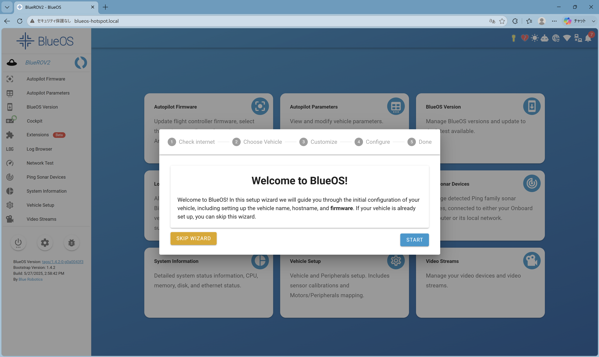

**Step 1: Check Internet（インターネット接続用WiFiへの接続）**  
WiFiネットワーク一覧が表示されます。インターネット接続用WiFiのSSIDを選択し、パスワードを入力して `Connect` をクリックします。  
※ これによりラズパイがインターネットに接続されます。ホットスポットは引き続き動作します。  
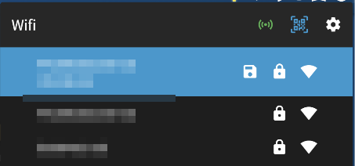

**Step 2: Choose Vehicle**  
vehicle typeとして `Other` を選択します。  
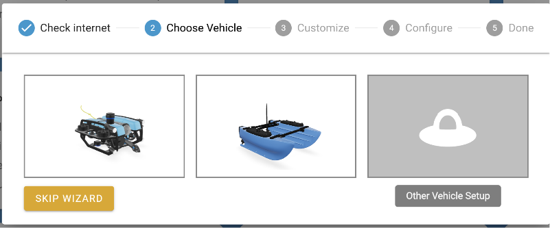

**Step 3: Customize**  
設定はデフォルトのままで構いません。`CONTINUE` をクリックします。  
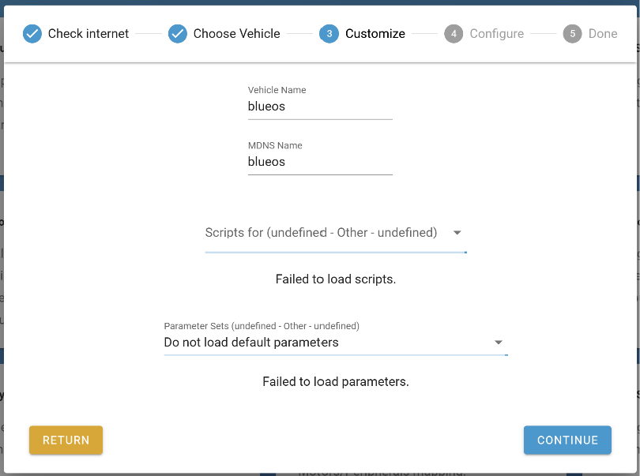

**Step 4: Configure**  
3項目にチェックが入っていることを確認して `APPLY` をクリックします。  
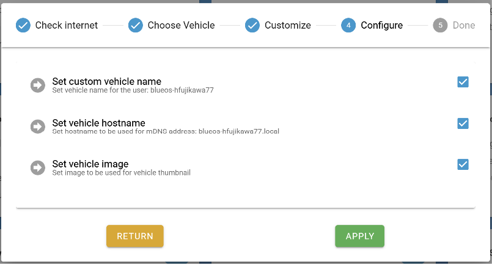

**Step 5: Done**  
ウィザード完了です。

### 2.3.3. 接続確認
SSHでログインできることを確認します。コマンドプロンプトを起動して下記コマンドを実行します。<br/>
<table>
<tr>
<th>Host</th>
<td>192.168.42.1</td>
</tr>
<tr>
<th>Username</th>
<td>pi</td>
</tr>
<tr>
<th>Password</th>
<td>raspberry</td>
</tr>
</table>
<br/>

```cmd
ssh pi@192.168.42.1 [エンターキー]
```

初めての接続時は質問が表示されるので `yes` と回答します。パスワードは入力しても画面に表示されませんが入力できています。入力ミスをした場合はバックスペースキーで削除できます。  
プロンプトが表示されたらログイン成功です。`exit` でログアウトします。
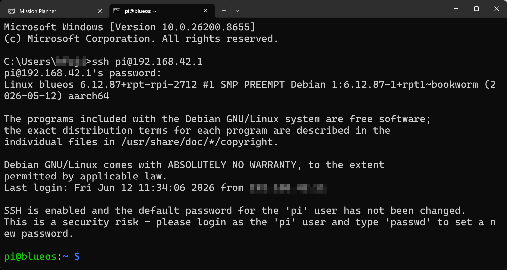

※ SSHログインは通常の手順では使用しませんが、トラブルシューティング等でラズパイ内のファイルを操作する際に使用します。

<div style="page-break-before:always"></div>

## 2.4. Pirate Modeの有効化
本書ではベータ版への切り替えや `MAVLink Inspector` などの高度な設定項目・メニューを使用するため、**Pirate Mode** を有効にする必要があります。

PC上でブラウザを起動して、BlueOS管理画面（[http://192.168.42.1](http://192.168.42.1)）を開きます。  
画面右上のアイコンバーにある **☠️ （海賊アイコン）** をクリックします。  
`ENABLE PIRATE MODE` ボタンをクリックします。  
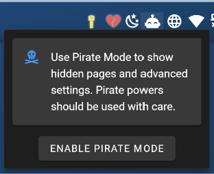

Pirate Modeが有効になると左メニューに `MAVLink Inspector` などの追加メニューが表示されます。

## 2.5. BlueOSのバージョン切り替え
本書で使用する `Manual` ボード機能（第3章で外部のSITLを機体として接続するために使用）は、BlueOS 1.5系で追加された機能です。本書ではバージョンを **`1.5.0-beta.37`** に固定して使用します。  
※ 執筆時点の安定版（1.4.3）にはこの機能がありません。1.5.0の正式リリース後はそちらに読み替えてください。

1. 左側メニューから `BlueOS Version` をクリックします。
1. リモートバージョン一覧から `1.5.0-beta.37` を探し、ダウンロードして適用します。
1. 適用するとBlueOSが再起動します。再起動後、画面左下のバージョン表示が `1.5.0-beta.37` になっていることを確認します。

※ ダウンロードには時間がかかります。インターネット接続（2.3.2 Step 1）が完了している必要があります。  
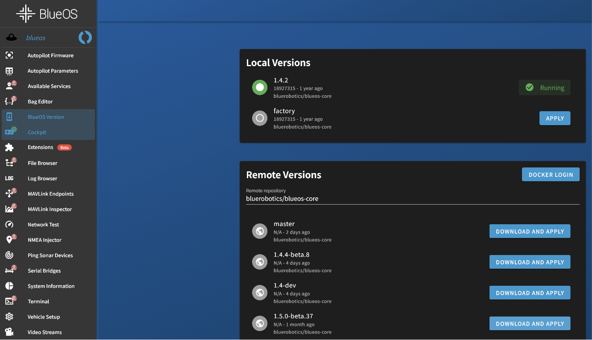

<div style="page-break-before:always"></div>

# 3. SITLの接続設定

本書ではラズパイにフライトコントローラー（FC）実機を接続する代わりに、**WSL上で動作するSITL**（Software In The Loop：ArduPilotのシミュレータ）を機体として使用します。  
BlueOSのボードを `Manual`（外部の機体ストリームを受け取るモード）に設定し、WSLのSITLからテレメトリを送り込むことで、BlueOSはSITLを実機FCと同じように扱います。

## 3.1. Manualボードへの切り替え
左側メニューから `Autopilot Firmware` をクリックします。  

画面下部の `CHANGE BOARD` ボタンをクリックし、ボード一覧から `Manual` を選択して適用します。  
※ Firmware update欄の `Board` リストボックスはファームウェアの書き込み先を選ぶものです。ボードの切り替えには使用しません。  
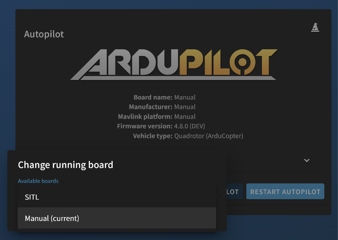

切り替え後、画面上部の表示が `Board name: Manual` になり、**Master Endpoint Configuration**（機体側からの接続を受け付ける設定）が表示されることを確認します。  
設定はデフォルトのまま使用します。

| 項目 | 値 |
|------|-----|
| Connection Type | UDP Server |
| IP/Device | 0.0.0.0 |
| Port | 14551 |
 
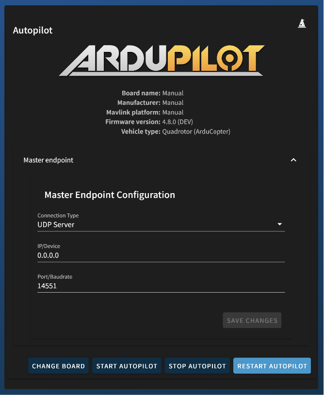

## 3.2. WSL上のSITLの起動
VS CodeでWSLに接続し、ターミナルを開きます。  
PCがBlueOSホットスポットに接続している状態で、下記コマンドでSITLを起動します。

```bash
sim_vehicle.py -v ArduCopter -L Kawachi --out udp:192.168.42.1:14551
```

- `-L Kawachi` : 起動場所としてドローンフィールドKawachiを指定します。
- `--out udp:192.168.42.1:14551` : テレメトリをBlueOS（Master Endpoint）に送信します。

※ SITLの起動方法の詳細は、環境構築手順書（`drone-dev-env-setup-guide.pdf`）の `8.1. シミュレータ動作確認` もご覧ください。

SITLが起動すると、BlueOSはこれを機体として認識します。  
このターミナルは開いたままにしてください（閉じるとSITLが終了し、機体が消えます）。SITLを終了する場合は `Ctrl+C` を押します。

<div style="page-break-before:always"></div>

# 4. 疎通確認

WSLのSITL → BlueOS（MAVLink Router）→ PC側クライアント の順にテレメトリが流れていることを確認します。  
クライアントごとの接続方法は下記の通りです。エンドポイントの追加設定は不要です。

| クライアント | 接続方法 | 備考 |
|------|------|------|
| Mission Planner | UDPCl 192.168.42.1:14550 | 起動時の自動検出ダイアログからも接続可 |
| Cockpit | ブラウザで `http://192.168.42.1` → 左メニュー | BlueOS内蔵のWeb GCS |

※ 実機FCを接続する場合も、ボードが `Manual` からシリアルボード（Pixhawk等）に変わるだけで、クライアント側の接続方法は同じです。

## 4.1. MAVLink Inspectorでの確認
まず、WSLのSITLからのテレメトリがBlueOSに届いていることを、BlueOSのWeb管理画面から確認します。

左側メニューから `MAVLink Inspector` をクリックします。  
`HEARTBEAT` や `ATTITUDE` などのMAVLinkメッセージがリアルタイムに受信・表示されていることを確認します。  
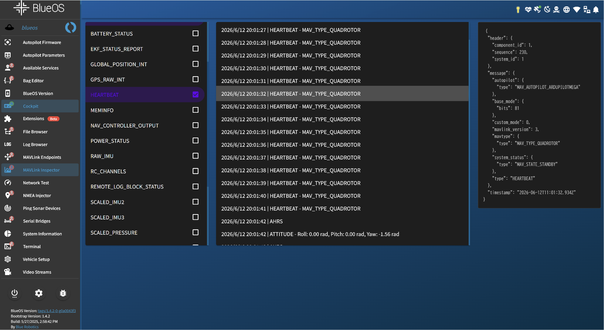

メッセージが表示されない場合は、第3章の設定（Manualボード、Master Endpoint、SITLの起動オプション）を見直してください。

## 4.2. Mission Plannerからの接続確認
PC側のGCSからテレメトリを受信できることを確認します。  
PCがBlueOSホットスポットに接続している状態で実施します。

Mission Plannerを起動します。  
起動時に下記のダイアログ（`A Mavlink stream has been detected, blueos-avahi...`）が表示された場合は、`Yes` をクリックします。これだけで接続が完了します。  
※ BlueOSが通知するMAVLinkストリームへの自動接続の確認です。  
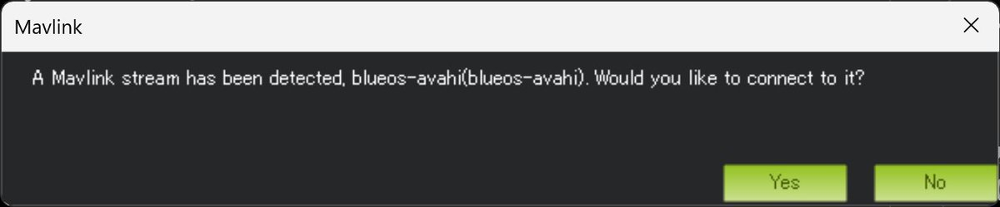

ダイアログが表示されなかった場合は、画面右上の接続リストボックスから `UDPCl` を選択して `接続` をクリックし、下記を入力します。

| 項目 | 値 |
|------|-----|
| remote host | 192.168.42.1 |
| remote Port | 14550 |

接続が完了すると、フライト・データ画面のHUDに姿勢・高度などのテレメトリが表示され、地図上のドローンフィールドKawachiに機体（シミュレータ）が表示されることを確認します。  
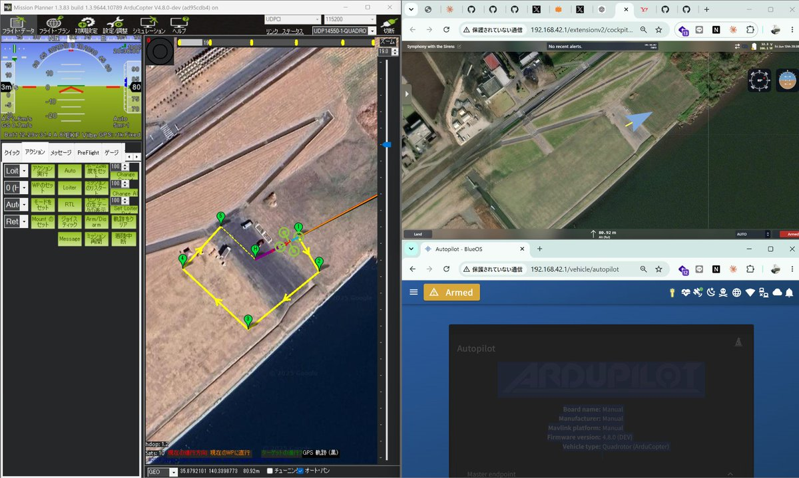

<div style="page-break-before:always"></div>

## 4.3. 飛行動作の確認（任意）
Mission Plannerから機体（SITL）にコマンドを送信できること（双方向の疎通）を確認します。

フライト・データ画面左下の `アクション` タブを開きます。
1. モードのリストボックスから `Guided` を選択して `モードをセット` をクリックします。
1. `Arm/Disarm` をクリックしてアームします。
1. 地図上で右クリックして `離陸` を選択し、高度 `10` を入力します。

機体が離陸して高度10mでホバリングすることを確認します。  
※ SITL起動直後はGPS測位（EKFの初期化）待ちでアームできないことがあります。その場合は1分ほど待ってから再実行してください。  
※ アームと離陸の操作の詳細は、環境構築手順書（`drone-dev-env-setup-guide.pdf`）の `2.3.1. アームと離陸` もご覧ください。

## 4.4. CockpitからのGCS接続確認（任意）
BlueOSに内蔵されたWebブラウザ版GCS「Cockpit」からテレメトリを確認します。  
Mission Plannerを使わずにブラウザだけで機体の状態を確認・操作できることを体験する目的で実施します。

PCのブラウザで `http://192.168.42.1` を開き、左メニューから `Cockpit` をクリックします。  
※ 左メニューに `Cockpit` が表示されない場合は、左メニュー下部の `Tools` → `Extensions Manager` からインストールしてください。

Cockpitの画面に切り替わり、機体（SITL）のテレメトリ（高度、機首方位、フライトモード等）が表示されることを確認します。
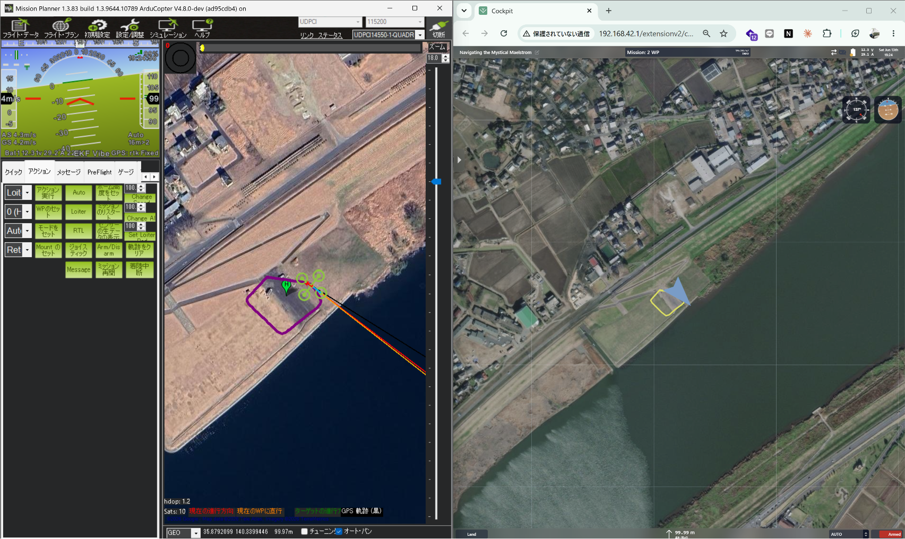

以上で環境構築は完了です。

<div style="page-break-before:always"></div>

# 5. Appendix
## 5.1. BlueOS
1. Official Website：[https://blueos.cloud/](https://blueos.cloud/)
2. Documentation：[https://blueos.cloud/docs/stable/](https://blueos.cloud/docs/stable/)
3. GitHub：[https://github.com/bluerobotics/BlueOS](https://github.com/bluerobotics/BlueOS)
4. Releases（イメージダウンロード）：[https://github.com/bluerobotics/BlueOS/releases](https://github.com/bluerobotics/BlueOS/releases)
## 5.2. ArduPilot SITL
1. ArduPilot Wiki：[https://ardupilot.org/dev/docs/sitl-simulator-software-in-the-loop.html](https://ardupilot.org/dev/docs/sitl-simulator-software-in-the-loop.html)
## 5.3. Mission Planner
1. ArduPilot Wiki：[https://ardupilot.org/planner/](https://ardupilot.org/planner/)
## 5.4. Cockpit
1. GitHub：[https://github.com/bluerobotics/cockpit](https://github.com/bluerobotics/cockpit)
2. ドキュメント：[https://blueos.cloud/docs/stable/extensions/cockpit/](https://blueos.cloud/docs/stable/extensions/cockpit/)
