<div align="center">
<h3>ドローンエンジニア養成塾 デベロッパーコース</h3>
<h2>コンパニオンコンピュータ環境構築手順書</h2><br>
(Raspberry Pi Zero 2W + Rpanion-Server + Visual Studio Code)<br/>
Ver.1.0.0 - 2024.5.30
</div>

<!--
Ver.1.0.0 - 2023.5.30 - 初版
-->

Table of Contents
<!-- @import "[TOC]" {cmd="toc" depthFrom=1 depthTo=6 orderedList=false} -->

<!-- code_chunk_output -->

- [1. はじめに](#1-はじめに)
  - [1.1. 実機導入の目的](#11-実機導入の目的)
  - [1.2. 前提事項](#12-前提事項)
- [2. ラズパイの初期セットアップ](#2-ラズパイの初期セットアップ)
  - [2.1. 事前準備](#21-事前準備)
  - [2.2. イメージのフラッシュ](#22-イメージのフラッシュ)
  - [2.3. 起動確認](#23-起動確認)
- [3. VS Codeからラズパイへの接続](#3-vs-codeからラズパイへの接続)
  - [3.1. SSH接続設定](#31-ssh接続設定)
  - [3.2. 接続確認](#32-接続確認)
- [4. シミュレータからラズパイへのテレメトリ転送](#4-シミュレータからラズパイへのテレメトリ転送)
  - [4.1. シミュレータの起動](#41-シミュレータの起動)
  - [4.2. ラズパイへのテレメトリ転送](#42-ラズパイへのテレメトリ転送)
- [5. ラズパイ側のテレメトリのルーティング](#5-ラズパイ側のテレメトリのルーティング)
  - [5.1. ラズパイ側テレメトリ受信確認](#51-ラズパイ側テレメトリ受信確認)
  - [5.2. ラズパイ内テレメトリ転送](#52-ラズパイ内テレメトリ転送)
- [6. ラズパイ上の開発環境構築](#6-ラズパイ上の開発環境構築)
  - [6.1. GitHubからソースコード取得とインストール](#61-githubからソースコード取得とインストール)
  - [6.2. VS Code拡張機能のインストール](#62-vs-code拡張機能のインストール)
  - [6.3. VS Code入力補完設定](#63-vs-code入力補完設定)
- [7. ラズパイ上のアプリケーションから接続確認](#7-ラズパイ上のアプリケーションから接続確認)
  - [7.1. MAVProxyからの確認](#71-mavproxyからの確認)
  - [7.2. Pymavlinkからの確認](#72-pymavlinkからの確認)
  - [7.3. DroneKit-Pythonからの確認](#73-dronekit-pythonからの確認)
- [8. Appendix](#8-appendix)
  - [8.1. Rpanion-Server](#81-rpanion-server)
  - [8.2. Mission Planner](#82-mission-planner)
  - [8.3. Visual Studio Code](#83-visual-studio-code)
  - [8.4. MAVLink-router](#84-mavlink-router)
  - [8.5. MAVProxy](#85-mavproxy)
  - [8.6. Pymavlink](#86-pymavlink)
  - [8.7. DroneKit Python](#87-dronekit-python)

<!-- /code_chunk_output -->

<div style="page-break-before:always"></div>

# 1. はじめに
本書はArduPilotドローンアプリケーション開発用コンパニオンコンピュータ環境を構築する手順書です。  
コンパニオンコンピュータとしてRaspberry Pi Zero 2W（以下、ラズパイ）、OSイメージとしてRpanion-Server、エディタ・IDEとしてVisual Studio Code（以下、VS Code）を使用します。  
本書で構築する開発環境の構成は下記の図の通りです。  
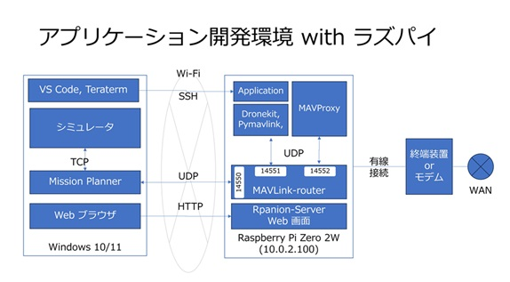  

## 1.1. 実機導入の目的
コンパニオンコンピュータ実機を導入することで座学習の理解をより一層深めることを第一の目的としています。  
- それぞれの技術要素、ソフト、ツールが実機のどこで利用されるのか。
- 実機ならではの問題に遭遇し、それの対処法を考える。
- アプリ開発⇔実機テストのサイクルをスムーズに行える。
- 卒業後でも継続して開発、運用のために活用できる。

## 1.2. 前提事項
デベロッパーコース向けの開発環境構築手順書（`drone-dev-env-setup-guide.pdf`）に則ってセットアップが完了している前提とします。  
Windows 10/11のPCにMission PlannerとVS Codeがインストールされていることを確認してください。

<div style="page-break-before:always"></div>  


# 2. ラズパイの初期セットアップ
## 2.1. 事前準備
下記の機器を準備します。1～3 はアプリケーションコース受講生には配布済みです。
1. ラズパイ本体
1. SDカード
1. ACアダプタ
1. SDカードリーダー（使用PCにSDカードリーダーがない場合）
1. microUSB 有線LAN 変換アダプター
1. LANケーブル

ラズパイにmicroUSB 有線LAN 変換アダプターを装着し、ONU or モデム にLANケーブルで接続して、WANにアクセスできるようにしておきます。  
※ アプリケーションコース講義ではラズパイとZoomに同時に接続する必要があるため、この構成で講義に参加してください。  
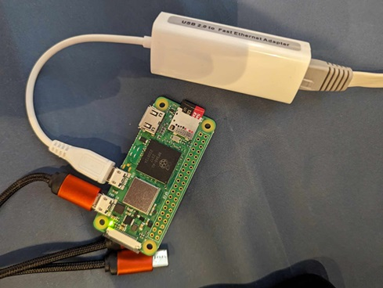

<div style="page-break-before:always"></div>

## 2.2. イメージのフラッシュ

下記Webサイトを開いて、Rpanion-Serverのイメージをダウンロードします。  
[https://www.docs.rpanion.com/software/rpanion-server](https://www.docs.rpanion.com/software/rpanion-server#disk_images)  
※ 2024年5月時点の最新版 0.10 が対象

Blena Etcherを入手して、SDカードにRpanion-Serverのイメージをフラッシュします。  
[https://etcher.balena.io/](https://etcher.balena.io/)  
使い方はとてもシンプルです。  
1. SDカードをPCに挿します。（SDカードスロットがないPCはカードリーダーを使う）
1. Balena Etcherを起動します。
1. 左側のボタンでダウンロードしたイメージファイルを選択します。
1. 真ん中のボタンでSDカードドライブを選択します。（くれぐれもPCのメインドライブを選択しないように!!!）
1. 右側のボタンでフラッシュを開始します。

## 2.3. 起動確認
ラズパイにSDカードを挿して、外側のマイクロUSBから電源供給してラズパイを起動します。  

30秒程度するとラズパイのWi-Fiアクセスポイントが起動しますので、
PCからラズパイのアクセスポイントにWiFi接続できることを確認します。<br/>
<table>
<tr>
<th>SSID</th>
<td>rpanion</td>
</tr>
<tr>
<th>Password</th>
<td>rpanion123</td>
</tr>
</table>

<br/><br/>
PCからラズパイにSSH接続できることを確認します。<br/>
<table>
<tr>
<th>Host</th>
<td>10.0.2.100</td>
</tr>
<tr>
<th>Username</th>
<td>pi</td>
</tr>
<tr>
<th>Passowrd</th>
<td>raspberry</td>
</tr>
</table>
<br/>

<div style="page-break-before:always"></div> 

`rpanion`というWi-Fiに接続している状態で、コマンドプロンプトを起動して次のコマンドを実行します。

```cmd
ssh pi@10.0.2.100 [エンターキー]
```

初めての接続時は質問が表示されるので `yes` と回答します。パスワードは入力しても表示されないですが入力できています。入力ミスをした場合はバックスペースキーで削除できます。<br/>
次の画像を参考にしてください。

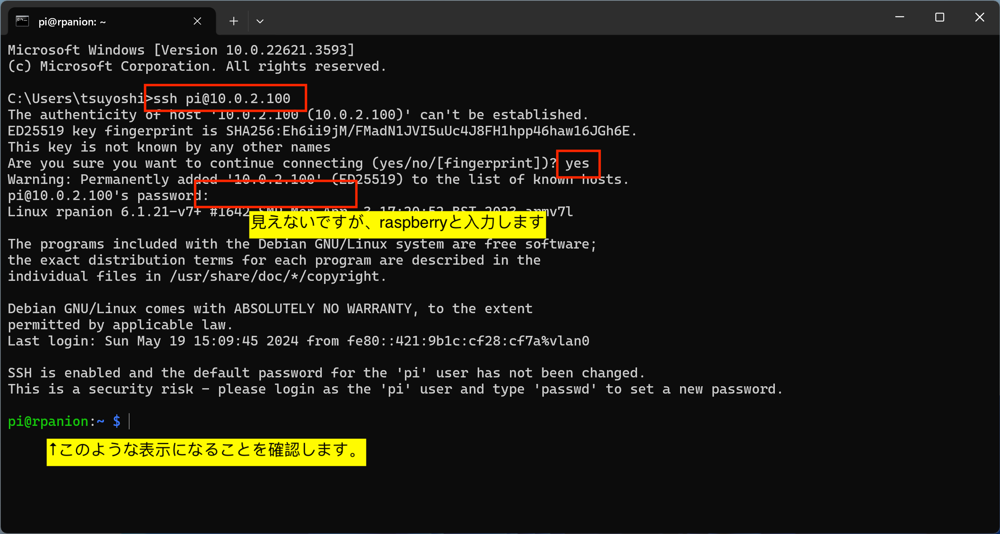

<div style="page-break-before:always"></div> 

# 3. VS Codeからラズパイへの接続

## 3.1. SSH接続設定
VS Codeを起動して、左側の `リモートエクスプローラー（PC画面のようなアイコン）` をクリックします。  
リストボックスから `リモート（トンネル/SSH）` を選択します。`SSH構成ファイルを開く（歯車のようなアイコン）`をクリックします。  
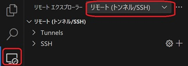

SSH構成ファイルを選択します。複数表示された場合はUsers配下のファイルを選択してください。  
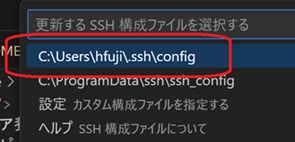

エディタが起動するので下記のように入力して保存してください。  
<!-- 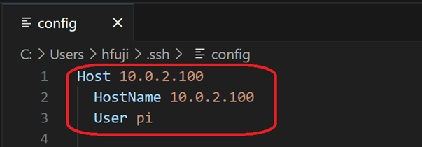 -->

```
Host 10.0.2.100
  HostName 10.0.2.100
  User pi
```

リモートエクスプローラーの`更新する（円に沿った矢印のアイコン）`をクリックします。  
SSHホストに`10.0.2.100` `pi` が追加されていることを確認します。  
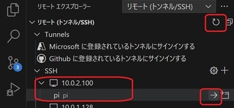

<div style="page-break-before:always"></div> 

## 3.2. 接続確認
`pi`の右側にある`現在のウィンドウで接続（→のアイコン）`をクリックします。  
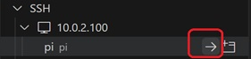

パスワードを聞かれるので、 `raspberry` を入力します。  
初回接続時は、VS Code接続のためのツールがラズパイにインストールされます。  
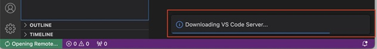


作業中にパスワードを聞かれることがある場合、同様に `raspberry` を入力してください。  
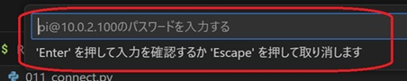

画面左下に `SSH: 10.0.2.100` と表示され、接続状態になっていることを確認します。  
エクスプローラーにラズパイ内のファイルが表示されていることを確認します。  
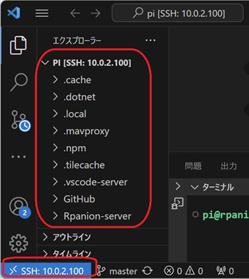

<div style="page-break-before:always"></div> 

# 4. シミュレータからラズパイへのテレメトリ転送
## 4.1. シミュレータの起動
タスクバーに`Mission Planner`を入力して、Mission Plannerを起動します。  
上部メニューの `シミュレーション` を押下して、シミュレーション画面に切り替えます。  
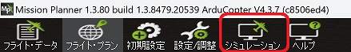  


ホームポジションを指定するため、Extra command line に `--home 35.879129,140.339683,7,0` （ドローンフィールドKawachiの場所） を入力して、画面下部の `Multirotor` のアイコン を押下します。   
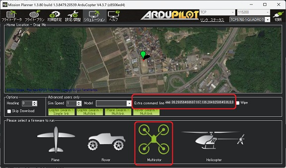  

Select your versionダイアログが表示されたら、`Stable` を押下します。  
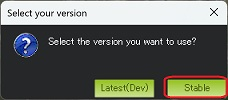  

シミュレータの実行ファイルがダウンロードが開始され、完了後に起動します。
起動後、フライト・データ画面に切り替わり、機体（シミュレータ）に接続されます。  
<!-- 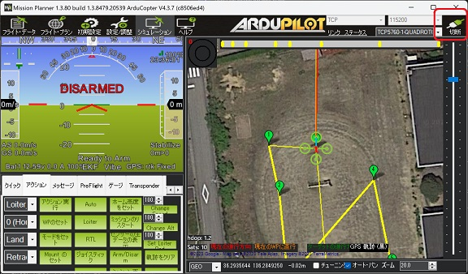   -->

<div style="page-break-before:always"></div>  

## 4.2. ラズパイへのテレメトリ転送
シミュレータが起動している状態で、Mission Planner上で`Ctrl + f`をクリックし、 `MAVLink` ボタンをクリックします。  
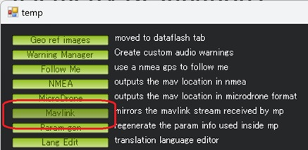

ダイアログのリストボックスから `UDP Client`を選択し、`4800`はそのまま、`アクセス、書込み`チェックボックスにチェックを付けて `接続`をクリックします。   
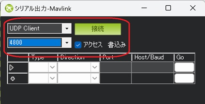

remote host `10.0.2.100`、remote Port `14550` をそれぞれ入力して `OK` をクリックします。  
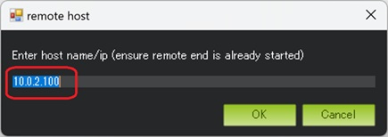
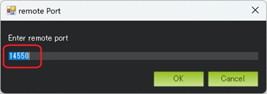

以上の手順でシミュレータのテレメトリがラズパイに転送されるようになります。

<div style="page-break-before:always"></div>  

# 5. ラズパイ側のテレメトリのルーティング
## 5.1. ラズパイ側テレメトリ受信確認
PC上でブラウザを起動して、下記URLを入力して Rpanion-Server Web 画面を開きます。  
[http://10.0.2.100:3000/controller](http://10.0.2.100:3000/controller)

UDP Server 欄の Enable UDP Server がチェック済、UDP Server Port が `14550` となっていることを確認して、ページ上部の`Start Telemetry` ボタンをクリックします。  
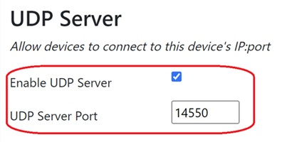
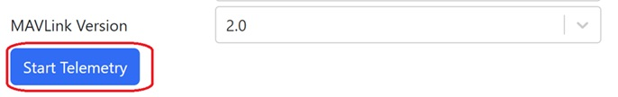

Status 欄の Connection Status: `Connected` となり、機体情報が表示されていることを確認します。  
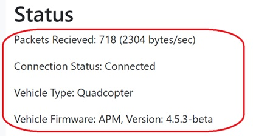

<div style="page-break-before:always"></div>  

## 5.2. ラズパイ内テレメトリ転送
UDP Client 欄のAdd new destination に `127.0.0.1:14551`、`127.0.0.1:14552` を入力して、それぞれ `Add` ボタンを をクリックします。  


UDP Client 欄に入力したIP:Portが追加されたことを確認します。シミュレータのテレメトリがこれらのIP:Portに転送されます。  
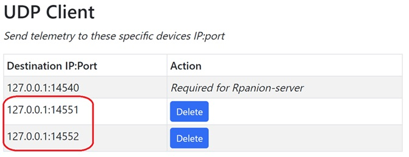

ページ上部の`Stop Telemetry`ボタンをクリック後、`Start Telemetry` ボタンをクリックします。  


以上の手順でテレメトリがラズパイ内に転送されます。

<div style="page-break-before:always"></div>  

# 6. ラズパイ上の開発環境構築
ラズパイへの開発ツールのインストール、ラズパイ用のVS Code設定を行います。
## 6.1. GitHubからソースコード取得とインストール
VS Codeを起動して、リモートエクスプローラーからラスパイに接続します。
メニュー `ターミナル` > `新しいターミナル` をクリックして、ターミナルを起動します。

下記コマンドを実行してGitHubから開発ツール、教材のソースコードを取得します。  

```bash
cd
mkdir GitHub
cd GitHub
git clone https://github.com/tajisoft/droneschool
git clone https://github.com/dronekit/dronekit-python
git clone https://github.com/ArduPilot/pymavlink
cd pymavlink
git clone https://github.com/ArduPilot/mavlink
```

下記コマンドを実行して各開発ツールをインストールします。

```bash
pip install --user mavproxy
cd  /home/pi/GitHub/dronekit-python
pip install --user .
cd  /home/pi/GitHub/pymavlink
pip install --user .
```

## 6.2. VS Code拡張機能のインストール
VS Codeをラズパイに接続している状態で、左側メニュー `拡張機能（ブロックのようなアイコン）`をクリックして拡張機能画面を開きます。  
下記の拡張機能を検索してラズパイ上にインストールします。

|Extentions|検索ワード|japanese|
|----|----|----|
|Python|Python|Python言語サポート|

<div style="page-break-before:always"></div>  

## 6.3. VS Code入力補完設定
メニュー `ファイル` → `ユーザ設定` → `設定` の順にクリックします。下記画面右上の設定ファイルアイコンをクリックします。
下記の設定を追加します。既存の設定がすでにある場合はご自身の環境に合わせて設定してください。

```json
{
    "python.autoComplete.extraPaths": [
        "/home/pi/GitHub/pymavlink",
        "/home/pi/GitHub/dronekit-python"
    ],
    "python.analysis.extraPaths": [
        "/home/pi/GitHub/pymavlink",
        "/home/pi/GitHub/dronekit-python"
    ],
    ～省略～
}
```

VS Codeを再起動します。  
下記画像のようにソースコードを入力した際に`Ctrl+SPACE`をクリックすると補完候補が表示されるようになっていればセットアップ完了です。  
* DroneKit-Python  
 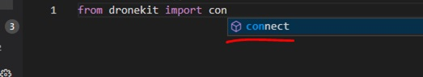  

* pymavlink  
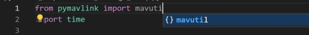  

<div style="page-break-before:always"></div>  

# 7. ラズパイ上のアプリケーションから接続確認

ラズパイ上のアプリケーションからシミュレータに接続できることを確認します。

## 7.1. MAVProxyからの確認
VS Codeを起動して、リモートエクスプローラーからラスパイに接続します。
メニュー `ターミナル` > `新しいターミナル` をクリックして、ターミナルを起動します。  
下記コマンドを実行してMAVProxyからシミュレータに接続できることを確認します。

```bash
mavproxy.py --master=127.0.0.1:14552
```

MAVProxyが起動している状態で下記コマンドを実行します。  

```bash 
mode guided
rc 3 1000
arm throttle
takeoff 10
```

Mission Plannerにて機体（シミュレータ）がGUIDEDモードに変更→アーム→離陸→高度10mまで上昇してホバリングという動作をとることを確認します。  
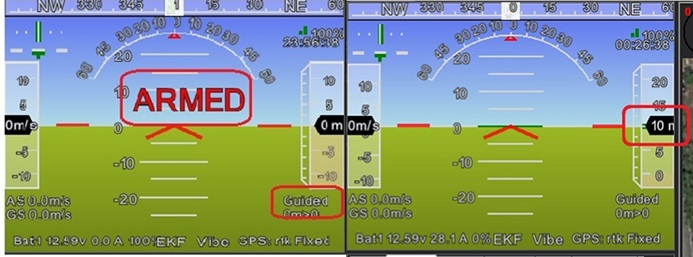


`Ctrl+C`で終了します。

<div style="page-break-before:always"></div>  

## 7.2. Pymavlinkからの確認
VS Codeのエクスプローラーから `GitHub/droneschool/pymavlink_scripts/pm01_message_dump.py` を開きます。
ソースコード4～5行目 の接続先が `127.0.0.1:14551` になっていることを確認します。

右上の`▷アイコン`をクリックします。ターミナルが起動し、Pythonスクリプトが実行されます。  
機体（シミュレータ）から受信したMAVLinkメッセージが一定間隔で表示されることを確認します。  
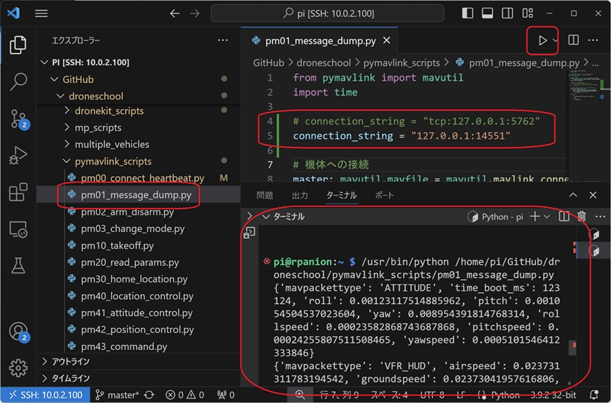


`Ctrl+C`で終了します。

<div style="page-break-before:always"></div>  

## 7.3. DroneKit-Pythonからの確認

VS Codeのエクスプローラーから `GitHub/droneschool/dronekit_scripts/011_connect.py` を開きます。
ソースコード4～5行目 の接続先が `127.0.0.1:14551` になっていることを確認します。

右上の`▷アイコン`をクリックします。ターミナルが起動し、Pythonスクリプトが実行されます。  
機体（シミュレータ）から受信した機体情報（対地速度、対空速度、モード、アーム状態、など）が一定間隔で表示されることを確認します。  
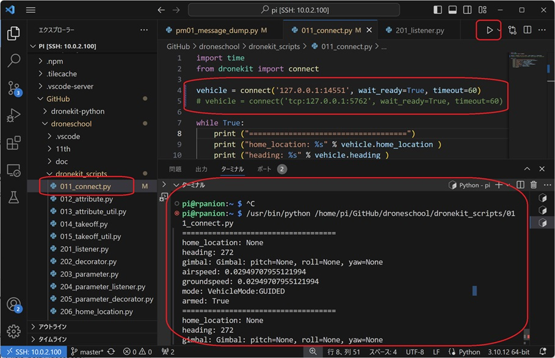

`Ctrl+C`で終了します。

<div style="page-break-before:always"></div>  

# 8. Appendix
## 8.1. Rpanion-Server
1. Official Website：[https://www.docs.rpanion.com/software/rpanion-server](https://www.docs.rpanion.com/software/rpanion-server)
2. GitHub：[https://github.com/stephendade/Rpanion-server](https://github.com/stephendade/Rpanion-server)
3. Kawamura Custom Image   
   * ラズパイに慣れている方向け。「microUSB 有線LAN 変換アダプター」が不要でiPhoneのテザリングに接続できる。
   * ダウンロード：[https://www.dropbox.com/scl/fi/b61taz2xoer14pydqgtzm/rpanion-for-drone-school-v1-20240519.img?rlkey=4h3jec3db3f7wcnylp8dtj9zg&st=68bsnihj&dl=0](https://www.dropbox.com/scl/fi/b61taz2xoer14pydqgtzm/rpanion-for-drone-school-v1-20240519.img?rlkey=4h3jec3db3f7wcnylp8dtj9zg&st=68bsnihj&dl=0)  
## 8.2. Mission Planner
1. ArduPilot Wiki：[https://ardupilot.org/planner/](https://ardupilot.org/planner/)
## 8.3. Visual Studio Code
1. Keyboard shortcuts：[https://code.visualstudio.com/shortcuts/keyboard-shortcuts-windows.pdf](https://code.visualstudio.com/shortcuts/keyboard-shortcuts-windows.pdf)
## 8.4. MAVLink-router
1. GitHub：[https://github.com/mavlink-router/mavlink-router](https://github.com/mavlink-router/mavlink-router)
## 8.5. MAVProxy
1. ArduPilot Wiki：[https://ardupilot.org/mavproxy/index.html](https://ardupilot.org/mavproxy/index.html)
## 8.6. Pymavlink
1. GitHub：[https://github.com/ArduPilot/pymavlink](https://github.com/ArduPilot/pymavlink)
2. Examples：[https://www.ardusub.com/developers/pymavlink.html](https://www.ardusub.com/developers/pymavlink.html)
## 8.7. DroneKit Python
1. Document：[https://dronekit-python.readthedocs.io/en/latest/](https://dronekit-python.readthedocs.io/en/latest/)
2. Examples：[https://github.com/dronekit/dronekit-python/tree/master/examples](https://github.com/dronekit/dronekit-python/tree/master/examples)
