<div align="center">
<h3>ドローンエンジニア会議 2023 in KAGA エンジニア養成講座</h3>
<h2>開発環境構築手順書</h2><br>
(Windows10/11 + WSL1(Ubuntu20.04) + Visual Studio Code)<br/>
Ver.1.4.2 - 2023.7.11
</div>

<!--
Ver.1.4.0 - 2023.5.26 - 初版
Ver.1.4.1 - 2023.6.9  - WSLインストール方法変更、PDFレイアウト調整、微修正
Ver.1.4.2 - 2023.7.11 - PDF生成方法修正、画像・コードの改行位置調整
-->

Table of Contents
<!-- @import "[TOC]" {cmd="toc" depthFrom=1 depthTo=6 orderedList=false} -->

<!-- code_chunk_output -->

- [1. はじめに](#1-はじめに)
- [2. Mission Planner セットアップ](#2-mission-planner-セットアップ)
  - [2.1. Mission Planner インストール](#21-mission-planner-インストール)
  - [2.2. シミュレータ（Mission Planner）の起動](#22-シミュレータmission-plannerの起動)
  - [2.3. Mission Plannerを使用した機体の基本操作](#23-mission-plannerを使用した機体の基本操作)
    - [2.3.1. アームと離陸](#231-アームと離陸)
    - [2.3.2. ミッション作成と自動飛行](#232-ミッション作成と自動飛行)
- [3. Visual Studio Codeインストール](#3-visual-studio-codeインストール)
- [4. WSLにUbuntuをインストール](#4-wslにubuntuをインストール)
  - [4.1. WSLの有効化設定とバージョン確認](#41-wslの有効化設定とバージョン確認)
  - [4.2. Ubuntu20のインストールと初期設定](#42-ubuntu20のインストールと初期設定)
- [5. Visual Studio CodeとWSLの連携](#5-visual-studio-codeとwslの連携)
  - [5.1. 拡張機能のインストール](#51-拡張機能のインストール)
  - [5.2. 日本語表示の有効化](#52-日本語表示の有効化)
  - [5.3. WSLとの接続](#53-wslとの接続)
- [6. WSL（Ubuntu20）へ拡張機能のインストール](#6-wslubuntu20へ拡張機能のインストール)
- [7. DroneKit Python セットアップ](#7-dronekit-python-セットアップ)
  - [7.1. pipのインストール](#71-pipのインストール)
  - [7.2. DroneKit Python最新のソースコードからインストール](#72-dronekit-python最新のソースコードからインストール)
  - [7.3. 自動補完セットアップ](#73-自動補完セットアップ)
  - [7.4. 自動補完の動作確認](#74-自動補完の動作確認)
  - [7.5. Pythonスクリプト実行の動作確認](#75-pythonスクリプト実行の動作確認)
  - [7.6. DroneKit Pythonの動作確認](#76-dronekit-pythonの動作確認)
- [8. Luaスクリプトのセットアップ](#8-luaスクリプトのセットアップ)
  - [8.1. Luaスクリプトの有効化](#81-luaスクリプトの有効化)
  - [8.2. Luaスクリプトの作成と機体へのアップロード](#82-luaスクリプトの作成と機体へのアップロード)
  - [8.3. Luaスクリプトの動作確認](#83-luaスクリプトの動作確認)
- [9. Appendix](#9-appendix)
  - [9.1. Mission Planner](#91-mission-planner)
  - [9.2. Visual Studio Code](#92-visual-studio-code)
  - [9.3. DroneKit Python](#93-dronekit-python)
  - [9.4. Lua Scripts](#94-lua-scripts)

<!-- /code_chunk_output -->

<div style="page-break-before:always"></div>

# 1. はじめに
本書はWindows10/11 + WSL1(Ubuntu20.04) + Visual Studio Code を使用してArduPilotドローンソフトウェアの開発・テストを行うための環境構築手順です。  
開発環境構成における本書の対象範囲は下図の通りとなります。  
  

<div style="page-break-before:always"></div>  

# 2. Mission Planner セットアップ
## 2.1. Mission Planner インストール
【注意】インストール済みの場合はスキップしてください。  

下記リンクをクリックして最新のインストーラをダウンロードします。  
https://firmware.ardupilot.org/Tools/MissionPlanner/MissionPlanner-latest.msi  

ダウンロードされたインストーラ `MissionPlanner-latest.msi` をダブルクリックします。  

ライセンスに同意して、基本的に`Next`、`Install`、`次へ`、`完了` を押下してインストールを完了させます。  

タスクバーに`Mission Planner`を入力して、Mission Plannerを起動します。  

Altitude Angelダイアログが表示されたら、`No`を押下します。（初回のみ）  

## 2.2. シミュレータ（Mission Planner）の起動
上部メニューの `シミュレーション` を押下して、シミュレーション画面に切り替えます。  
  

ホームポジションを指定するため、Extra command line に `--home 36.29356468607107,136.284925064536,0,0` （加賀市立三木小学校の場所） を入力して、画面下部の `Multirotor` のアイコン を押下します。   
  

Select your versionダイアログが表示されたら、`Stable` を押下します。  
  

シミュレータの実行ファイルがダウンロードが開始され、完了後に起動します。
起動後、フライト・データ画面に切り替わり、機体（シミュレータ）に接続されます。  
  

シミュレータを終了するには、タイトルバーに `ArduCopter.exe` が表示されているターミナルのウィンドウを閉じます。  
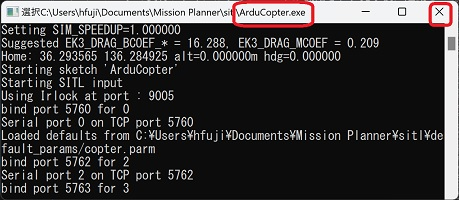  

二回目以降は`Skip Download` にチェックを付けることで、実行ファイルのダウンロードをスキップしてシミュレータを起動できます。  
  

<div style="page-break-before:always"></div>  

## 2.3. Mission Plannerを使用した機体の基本操作
【注意】この手順は機体（シミュレータ）に接続している状態で行ってください。  
### 2.3.1. アームと離陸
上部メニューの `フライト・データ` を押下してフライト・データ画面に切り替えます。  
  

アクションタブを開き、リストボックスから `Guided` を選択して、 `モードをセット` ボタンを押下して、機体のモードをGUIDEDモードに切り替えます。`Arm/Disarm` ボタンを押下して、機体をアームします。  
  
HUDに下記の通り、`ARMED` , `Guided` が表示されていることを確認します。  
  

マップエリアで右クリック → `離陸` を押下 → Enter Altダイアログに `10` を入力して、`OK` を押下します。  


機体が離陸し、高度10メートルまで上昇してホバリングすることを確認します。  
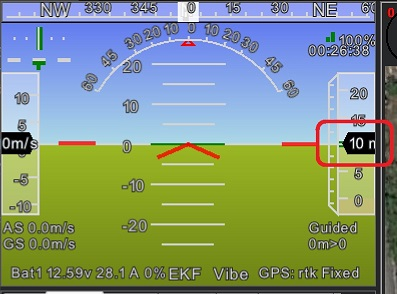  

<div style="page-break-before:always"></div>  

目的地を指定した自動飛行を行う場合、マップエリアの任意の場所で右クリック → `ここまで飛行` を押下 →  Enter Altダイアログに `10` を入力して、`OK` を押下します。  

  

指定した地点への自動飛行が開始されます。目的地に到達すると機体はホバリングします。  
  

その場で着陸する場合は、リストボックスから `Land` を選択して、 `モードをセット` ボタンを押下します。ホームポジションに戻って着陸する場合は、`RTL` ボタンを押下します。  

<div style="page-break-before:always"></div>  

### 2.3.2. ミッション作成と自動飛行
【注意】この手順は機体（シミュレータ）がホバリングしている状態で行ってください。  

上部メニューの `フライト・プラン` を押下してフライト・プラン画面に切り替えます。  
  

デフォルト高度に`10`を入力します。マップエリアを左クリックしてウェイポイントを追加してミッションを作成します。`WPの書込み` ボタンを押下して、作成したミッションを機体にアップロードします。  
  

上部メニューの `フライト・データ` を押下してフライト・データ画面に切り替えます。  
  

<div style="page-break-before:always"></div>  

アクションタブを開き、`Auto` ボタンを押下して、AUTOモードに切り替えます。  
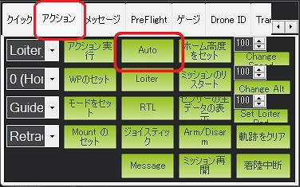  

作成したミッションに基づいた自動飛行が開始されます。ミッションが完了すると機体はホバリングします。  
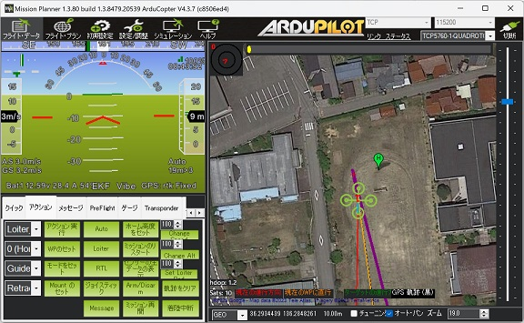  

ミッションを再実行する場合は、LOITER, GUIDEDなど別のモードに切り替えた後、AUTOモードに切り替えます。  

<div style="page-break-before:always"></div>  

# 3. Visual Studio Codeインストール
【注意】インストール済みの場合はスキップしてください。  

下記サイトを開きます。  
https://code.visualstudio.com/  
`Download for Windows Stable Build` をクリックするとダウンロードが開始されます。  
ダウンロードされた exeファイル `VSCodeUserSetup-x64-＜バージョン番号＞.exe` をダブルクリックしてインストールを進めてください。

<div style="page-break-before:always"></div>  

基本的に `次へ` 、 `インストール` をクリックしてインストールを進めます。下記の画面では `PATHへの追加` を選択してください。  

  

Visual Studio Codeのインストールが完了したらPCを再起動して次のステップに進みます。

<div style="page-break-before:always"></div>

# 4. WSLにUbuntuをインストール
## 4.1. WSLの有効化設定とバージョン確認
あまり古いバージョンのWindows10だとWSL機能が使えないため念の為バージョンを確認してください。  
確認するためにPowerShellで `winver` を実行して確認してください。 
```powershell
winver
```
下記の画面が表示されます。  
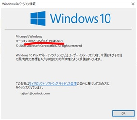  

WSLをインストールするためには、Windows 10 version 2004(Build 19041)以上、もしくはWindows 11である必要があります。古い場合はWindows10の更新、またはWindows 11のインストールを先に完了してから再度このステップから実行してください。  
社用PCなどセキュリティ対策が施されている場合、仮想化機能が無効化されている場合はセットアップが失敗する可能性があります。自社のテクニカルサポート部門にお問合せください。<br/>
WSLのインストールが可能な条件を満たしている場合次のページのインストールに進んでください。

WSL有効化をするために、PowerShellを管理者権限で開きます。  
タスクバーの検索窓に `PowerShell` を入力して検索します。  
  

<div style="page-break-before:always"></div>

検索結果に表示された `Windows PowerShell` の右側にある `>` ボタンをクリックし、`管理者として実行する` をクリックします。  

  

立ち上がったPowerShellのウィンドウに次の2つのコマンドを順番に実行し、PCを再起動してください。
```powershell
dism.exe /online /enable-feature /featurename:Microsoft-Windows-Subsystem-Linux /all /norestart
```
```powershell
dism.exe /online /enable-feature /featurename:VirtualMachinePlatform /all /norestart
```

PC再起動後、PowerShellを開いて次のコマンドを実行しPowerShellを閉じてください。これでデフォルトのバージョンを1にします。  
デフォルトが1で困る場合は、WSLバージョン2でインストールした後で個別に `wsl --set-version Ubuntu-20.04 1` を実行して変更してください。
```powershell
wsl --set-default-version 1
```
## 4.2. Ubuntu20のインストールと初期設定
【注意】すでにUbuntu 20.04がインストール済みの場合はスキップしてください。

PowerShellを開いて次のコマンドを実行して`Ubuntu 20.04`をインストールしてください。
```powershell
wsl --install -d Ubuntu-20.04
```

インストールが完了したら `PCを再起動` をしてください。<br/>
PC起動後の初回起動時 `Installing, this may take a few minutes…` としばらく表示されます。フリーズではないので、そのままインストールが完了するまで待ちます。  
インストールが終わると username と password をきかれるので、下記の通り入力して設定します。必ず半角英字のみで設定します。

* username : `ardupilot`
* password : `ardupilot` 

パスワードは入力してもセキュリティ上表示されませんが入力されています。間違えた場合はバックスペースで消せます。
画像のようになればUbuntuのインストールは完了です。このウィンドウを閉じます。  
  

念の為、WSLのバージョンを確認します。PowerShellを起動し次のコマンドを実行して確認してください。
```powershell
wsl -l -v
```
VERSIONのところが `1` と表示されていれば問題ありません。
```powershell
  NAME                   STATE           VERSION
* Ubuntu-20.04           Running         1
```

> **Note**
> WSLはバージョン1と2を混在させることができます。WSL2はUSB接続を可能にする手順が複雑なため、実機デバイスなどを接続する場合WSL1を推奨します。シミュレータしか使用しない場合はWSL2の方が処理速度が速いのでオススメです。

Ubuntuのインストールが完了したら、Visual Studio Codeと連携するため次のステップに進んでください。  

<div style="page-break-before:always"></div>

# 5. Visual Studio CodeとWSLの連携
【注意】すでに連携済みの場合はスキップしてください。  

Visual Studio Codeを起動します。初回起動時に次のような警告ウィンドウが表示される場合 `アクセスを許可する` を選択してください。  


Visual Studio Codeが起動したら次の手順に進んでください。
## 5.1. 拡張機能のインストール
左側の `Extensions（ブロックのようなアイコン）` を選択し拡張機能をインストールします。検索欄に `remote dev` を入力し検索し `Remote Development` を選択します。詳細画面にある `Install` を選択してください。  


<div style="page-break-before:always"></div>

同様の手順で次の拡張機能もインストールしてください。

|Extentions|検索ワード|japanese|
|----|----|----|
|Japanese Language Pack for Visual Studio Code|japanese|表示の日本語化|
|Python|Python|Python言語サポート|
|C/C++|C++|C/C++言語サポート|
|Lua|Lua|Lua言語サポート|
|Docker|Docker|Dockerサポート|
|ardupilot-devenv|ardupilot|ArduPilot開発サポート|
|Lua Autocomplete for ArduPilot|ardupilot|ArduPilot用Lua言語サポート|

## 5.2. 日本語表示の有効化
`Ctrl + Shift + P` を押して表示される入力エリアに `Configure Di` と入力します。  
表示される候補の中から `Configure Display Language` を選択します。  


その後に表示される候補から `日本語(ja)` を選択します。   


Visual Studio Codeを再起動を促されるので再起動します。起動したら次の手順に進んでください。 
## 5.3. WSLとの接続
画像のように左側の `リモートエクスプローラー（PC画面のようなアイコン）` を選択します。  
画面が変わったら、 `リモートエクスプローラー` を `WSLターゲット` に変更します。画像のようにインストールした `Ubuntu-20.04` が表示されているか確認します。WSLに詳しい方はこの通りでなくても問題ありませんのでビルド環境セットアップに進んでください。  
  

`Ubuntu-20.04` を右クリックし `既定のディストリビューションとして設定` を選択しデフォルトに設定します。  
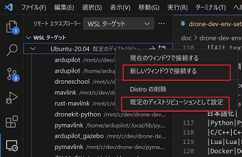

設定したら次は、同じ右クリックメニューの `新しいウィンドウで接続する` でWSLに接続します。
新しいウィンドウが開き、左下の部分が画像のような接続した状態になっていることを確認します。  


<div style="page-break-before:always"></div>

# 6. WSL（Ubuntu20）へ拡張機能のインストール
Visual Studio Codeを起動し、WSL（Ubuntu-20.04）に接続します。  
メニューを `ファイル` -> `フォルダーを開く` の順に選択し、前項でダウンロードしたardupilotディレクトリ（パス：`/home/ardupilot/ardupilot`）を開きます。  
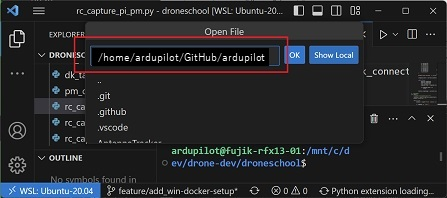  

初回は信頼ダイアログが表示されるので `はい、作成者を信頼します` を選択します。  


[Visual Studio CodeとWSLの連携](#4-visual-studio-codeとwslの連携) の手順を参考にして下記の拡張機能をインストールします。

|Extentions|検索ワード|japanese|
|----|----|----|
|Python|Python|Python言語サポート|
|C/C++|C++|C/C++言語サポート|
|Lua|Lua|Lua言語サポート|
|Docker|Docker|Dockerサポート|
|ardupilot-devenv|ardupilot|ArduPilot開発サポート|
|Lua Autocomplete for ArduPilot|ardupilot|ArduPilot用Lua言語サポート|

<div style="page-break-before:always"></div>

# 7. DroneKit Python セットアップ
Ubuntu20.04、Visual Studio Codeを全部終了してください。次にVisual Studio Codeを起動しWSLに接続します。  
メニュー `ターミナル` → `新しいターミナル` を選択します。

## 7.1. pipのインストール
【注意】インストール済みの場合はスキップしてください。  

ターミナルタブに次のコマンドを順番に実行してください。パスワードや続行可否を聞かれるので、都度入力してください。  
```bash
sudo apt update
```
```bash
sudo apt install python3-pip
```
```bash
pip -V
```
下記のように表示されたら正常にインストールされています。  
```bash
pip 22.0.2 from /usr/lib/python3/dist-packages/pip (python 3.10)
```

## 7.2. DroneKit Python最新のソースコードからインストール
<!-- Ubuntu20.04、Visual Studio Codeを全部終了してください。次にVisual Studio Codeを起動しWSLに接続します。

メニュー `ターミナル` → `新しいターミナル` を選択します。 -->
ターミナルタブに次のコマンドを順番に実行してください。
```bash
cd
```
```bash
git clone https://github.com/dronekit/dronekit-python
```
```bash
cd dronekit-python
```
```bash
pip3 install . --user
```
下記のような実行結果になれば正常にインストールが完了しています。  
```bash
Requirement already satisfied: monotonic>=1.3 in /home/ardupilot/.local/lib/
～省略～
Successfully built dronekit
Installing collected packages: dronekit
  Attempting uninstall: dronekit
    Found existing installation: dronekit 2.9.2
    Uninstalling dronekit-2.9.2:
      Successfully uninstalled dronekit-2.9.2
Successfully installed dronekit-2.9.2
```

## 7.3. 自動補完セットアップ
メニュー `ファイル` → `ユーザ設定` → `設定` の順に選択します。下記画面右上の設定ファイルアイコンをクリックします。  
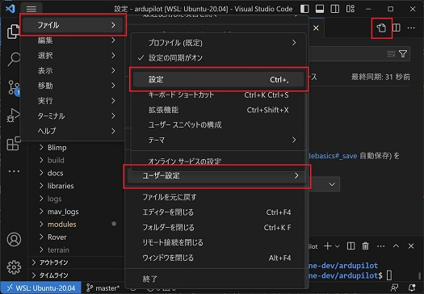  

下記の設定を追加します。既存の設定がすでにある場合はご自身の環境に合わせて設定してください。  
※ DroneKit Python のクローン先が `/home/ardupilot` の場合です。異なる場合は適宜修正してください。
```json
{
    "python.autoComplete.extraPaths": [
        "/home/ardupilot/dronekit-python"
    ],
    "python.analysis.extraPaths": [
        "/home/ardupilot/dronekit-python"
    ],
    ～省略～
}
```

## 7.4. 自動補完の動作確認
自動補完の動作確認をするために `ファイル` → `新規ファイル` を選択してください。  
  

次に、新規ファイルウィンドウ部分にフォーカスし `Ctrl + s` で保存メニューを表示してください。`/home/ardupilot/test.py` となるように保存します。   
  

画像のようにソースコードを入力後に `Ctrl + space`を押下して補完候補が表示されていればセットアップ完了です。  
  

## 7.5. Pythonスクリプト実行の動作確認
`test.py` を開いて 下記のように編集・保存して、右上の`▷`ボタンを押下します。  
  

下記ダイアログが表示された場合、`Python インタープリターの選択` を押下します。  
  

<div style="page-break-before:always"></div>

ターミナルで `which python3` コマンドを実行して表示される場所（下記画面では`/usr/bin/python3`）を選択します。  
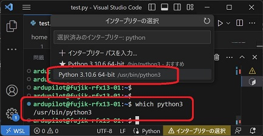  

再度、`test.py` を開いて 右上の`▷`ボタンを押下します。ターミナルに下記のように表示されることを確認します。  
```bash
hello dronekit!
```

## 7.6. DroneKit Pythonの動作確認
[シミュレータ（Mission Planner）の起動](#22-シミュレータmission-plannerの起動) の手順を参考にして、シミュレータを起動してMission Plannerから接続します。  

`test.py` を開いて、下記のように編集・保存して、右上の`▷`ボタンを押下します。  
```python
from dronekit import connect

# 機体に接続
vehicle = connect('tcp:127.0.0.1:5762')

# GUIDEDモード変更
vehicle.wait_for_mode("GUIDED")

# アーム
vehicle.arm()
```  

<div style="page-break-before:always"></div>

スクリプトが正常終了し、Mission PlannerのHUDにアーム状態:`ARMED`, モード:`Guided` が表示されることを確認します。  
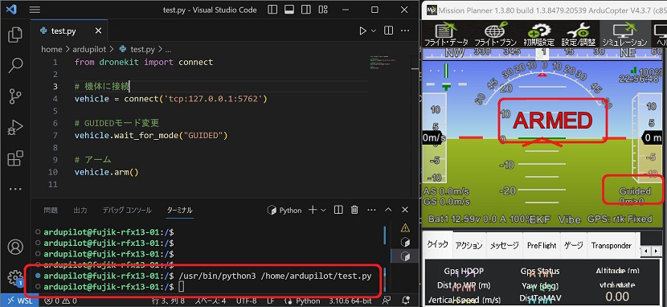  

<div style="page-break-before:always"></div>

# 8. Luaスクリプトのセットアップ
[シミュレータ（Mission Planner）の起動](#22-シミュレータmission-plannerの起動) の手順を参考にして、シミュレータを起動してMission Plannerから接続します。  

## 8.1. Luaスクリプトの有効化
Mission Planner の上部メニュー `設定/調整` → `フルパラメータリスト` を開きます。下記の通り該当パラメータの値を変更して、`パラメータ書込` ボタンを押下します。  
|コマンド|値|
|---|---|
|SCR_ENABLE|1|

## 8.2. Luaスクリプトの作成と機体へのアップロード
Windows上で任意のエディタ（自動補完が効くVisual Studio Code推奨）を開いて、下記内容を入力して、ファイル名 `hello_world.lua` として保存します。
```lua
function update()
    gcs:send_text(0, "hello, world") 
    return update, 5000
end

return update()
```

Mission Planner 上部メニュー `設定/調整` → `MAVFtp` を開きます。`/scripts` フォルダを作成し、`hello_world.lua` をアップロードします。フォルダ作成、ファイルアップロードは右クリックで行います。  
  

<div style="page-break-before:always"></div>

## 8.3. Luaスクリプトの動作確認
上部メニュー `フライト・データ` → アクションタブを開きます。リストボックスから`Preflight_Reboot_Shutdown` を選択して、`アクション実行`ボタンを押下して、機体を再起動します。  
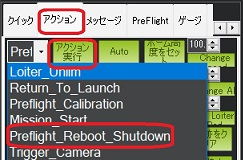  

`接続`ボタンを押下して、機体に再接続します。
HUDウィンドウ、メッセージタブに `hello, world` が表示されていれば、スクリプトが正常に動作している状態です。  
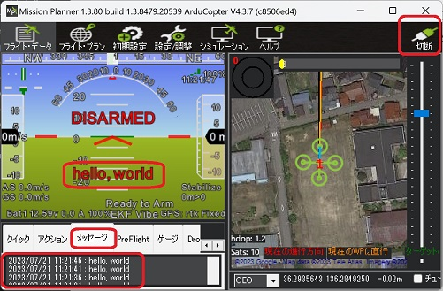  

スクリプトを停止するには、上部メニュー `設定/調整` → `MAVFtp` を開いて、`/scripts/hello_world.lua` を削除して、機体を再起動します。

<div style="page-break-before:always"></div>

# 9. Appendix
## 9.1. Mission Planner
* ArduPilot Wiki：[https://ardupilot.org/planner/](https://ardupilot.org/planner/)
## 9.2. Visual Studio Code
* Keyboard shortcuts：[https://code.visualstudio.com/shortcuts/keyboard-shortcuts-windows.pdf](https://code.visualstudio.com/shortcuts/keyboard-shortcuts-windows.pdf)
## 9.3. DroneKit Python
* Document：[https://dronekit-python.readthedocs.io/en/latest/](https://dronekit-python.readthedocs.io/en/latest/)
* Examples：[https://github.com/dronekit/dronekit-python/tree/master/examples](https://github.com/dronekit/dronekit-python/tree/master/examples)

## 9.4. Lua Scripts
* ArduPilot Wiki：[https://ardupilot.org/copter/docs/common-lua-scripts.html](https://ardupilot.org/copter/docs/common-lua-scripts.html)
* Examples : [https://github.com/ArduPilot/ardupilot/tree/master/libraries/AP_Scripting/examples](https://github.com/ArduPilot/ardupilot/tree/master/libraries/AP_Scripting/examples)