開発環境構築
Windows10 / 11
WSL(Windows SubSystem for Linux)
Visual Studio Code

2022.10.28
Ver.1.3.0

- [1. Visual Studio Codeインストール](#1-visual-studio-codeインストール)
- [2. WSLにUbuntuをインストール](#2-wslにubuntuをインストール)
  - [2.1. WSLの有効化設定とバージョン確認](#21-wslの有効化設定とバージョン確認)
- [3. Ubuntu20のインストールと初期設定](#3-ubuntu20のインストールと初期設定)
- [4. Visual Studio CodeとWSLの連携](#4-visual-studio-codeとwslの連携)
- [5. ArduPilotビルド環境セットアップ](#5-ardupilotビルド環境セットアップ)
  - [5.1. ArduPilotソースコードをクローン](#51-ardupilotソースコードをクローン)
  - [5.2. セットアップスクリプトで環境をインストール](#52-セットアップスクリプトで環境をインストール)
- [6. Visual Studio Code拡張機能インストール](#6-visual-studio-code拡張機能インストール)
- [7. シミュレータ（SITL）用セットアップ](#7-シミュレータsitl用セットアップ)
- [8. シミュレータ（Gazebo）用セットアップ（任意）](#8-シミュレータgazebo用セットアップ任意)
  - [8.1. Gazeboのインストール](#81-gazeboのインストール)
  - [8.2. プラグインのインストール](#82-プラグインのインストール)
  - [8.3. シミュレータの起動](#83-シミュレータの起動)
- [9. 【Applicationコース向け】DroneKit Python, pymavlinkセットアップ](#9-applicationコース向けdronekit-python-pymavlinkセットアップ)
  - [9.1. DroneKit Python最新のソースコードからインストール](#91-dronekit-python最新のソースコードからインストール)
  - [9.2. pymavlinkソースコードの取得](#92-pymavlinkソースコードの取得)
  - [9.3. 自動補完セットアップ](#93-自動補完セットアップ)
  - [9.4. 動作確認](#94-動作確認)
- [10. 【FlightCodeコース向け】デバッグ環境セットアップ](#10-flightcodeコース向けデバッグ環境セットアップ)
  - [10.1. 必要なパッケージインストール](#101-必要なパッケージインストール)
  - [10.2. デバッグ構成を追加](#102-デバッグ構成を追加)
  - [10.3. ブレークポイントを置く](#103-ブレークポイントを置く)
  - [10.4. デバッグ実行](#104-デバッグ実行)


# 1. Visual Studio Codeインストール
【注意】インストール済みの場合はスキップしてください。  

https://code.visualstudio.com/  
`Visual Studio Codeのダウンロード` -> `Windows X64` を押下しダウンロードを開始する。  
ダウンロードされるバージョンが手順書の表示と異なる場合、バージョン番号は最新に読み替えてください。

# 2. WSLにUbuntuをインストール
## 2.1. WSLの有効化設定とバージョン確認
あまり古いバージョンのWindows10だとWSL機能が使えないため念の為バージョンを確認してください。  
確認するためにPowerShellで `winver` を実行して確認してください。 
```powershell
winver
```

WSL有効化をするために、PowerShellを管理者権限で開き、次の2つのコマンドを順番に実行し、PCを再起動してください。
```powershell
dism.exe /online /enable-feature /featurename:Microsoft-Windows-Subsystem-Linux /all /norestart
```
```powershell
dism.exe /online /enable-feature /featurename:VirtualMachinePlatform /all /norestart
```

PC再起動後、PowerShellを開いて次のコマンドを実行しPowerShellを閉じてください。これでデフォルトのバージョンを1にします。  
デフォルトが1で困る場合は、2でインストールした後で `wsl --set-version Ubuntu-20.04 1` を実行して変更してください。
```powershell
wsl --set-default-version 1
```

# 3. Ubuntu20のインストールと初期設定
【注意】すでにUbuntu 20.04.5がインストール済みの場合はスキップしてください。

Windowsストアアプリを開き `ubuntu` と検索し `Ubuntu 20.04.6 LTS` を選択してください。
Ubuntu 20.04 LTSの詳細画面が表示されたら `入手` を選択しダウンロードおよびインストールしてください。  
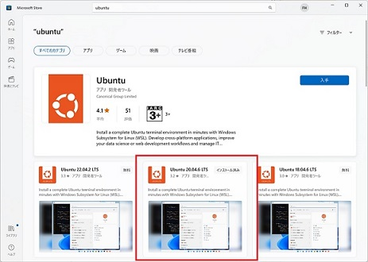  

インストールが完了したら `開く` を選択してください。画面を閉じてしまった場合は、Windowsメニューから `Ubuntu 20.04.6 LTS` を選択して起動してください。  
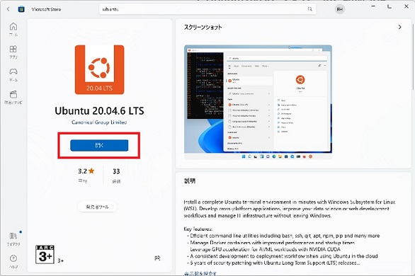  

初回起動時 `Installing, this may take a few minutes…` としばらく表示されます。フリーズではないので、そのままインストールが完了するまで待ちます。  
インストールが終わると password と password をきかれるので、下記の通り入力して設定します。必ず半角英字のみで設定します。

* username : `ardupilot`
* password : `ardupilot` 

パスワードは入力してもセキュリティ上表示されませんが入力されています。間違えた場合はバックスペースで消せます。
画像のようになればUbuntuのインストールは完了です。このウィンドウを閉じます。
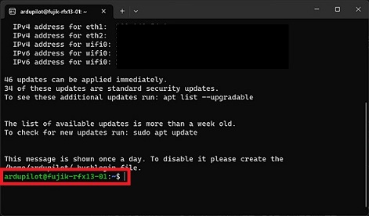  

念の為、WSLのバージョンを確認します。PowerShellを起動し次のコマンドを実行して確認してください。
```powershell
wsl -l -v
```
VERSIONのところが `1` と表示されていれば問題ありません。
```powershell
  NAME                   STATE           VERSION
* Ubuntu-20.04           Running         1
```

> **Note**
> WSLはバージョン1と2を混在させることができます。WSL2はUSB接続を可能にする手順が複雑なため、実機デバイスなどを接続する場合WSL1を推奨します。シミュレータしか使用しない場合はWSL2の方が処理速度が速いのでオススメです。

Ubuntuのインストールが完了したら、Visual Studio Codeと連携するため次のステップに進んでください。
# 4. Visual Studio CodeとWSLの連携
【注意】すでに連携済みの場合はスキップしてください。  

Visual Studio Codeを起動します。初回起動時に次のような警告ウィンドウが表示される場合 `アクセスを許可する` を選択してください。  
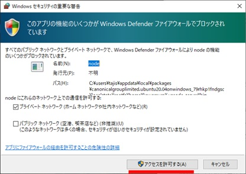

Visual Studio Codeが起動したら次のページに進んでください。

左側の `Extensions（ブロックのようなアイコン）` を選択し拡張機能をインストールします。検索欄に `remote dev` を入力し検索し `Remote Development` を選択します。詳細画面にある `Install` を選択してください。  
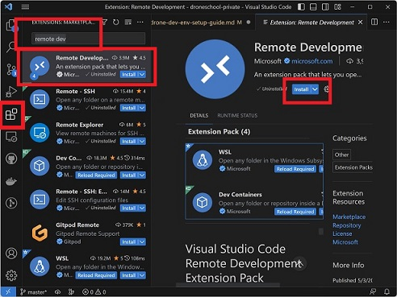

同様の手順で次の拡張機能もインストールしてください。

|Extentions|検索ワード|japanese|
|----|----|----|
|Japanese Language Pack for Visual Studio Code|japanese|表示の日本語化|
|Python|Python|Python言語サポート|
|C/C++|C++|C/C++言語サポート|
|Lua|Lua|Lua言語サポート|
|Docker|Docker|Dockerサポート|
|ardupilot-devenv|ardupilot|ArduPilot開発サポート|
|Lua Autocomplete for ArduPilot|ardupilot|ArduPilot用Lua言語サポート|

インストールが完了したら、Visual Studio Codeを再起動します。再度Visual Studio Codeを起動したら次の手順に進んでください。  

画像のように左側の `Remote Explorer（PC画面のようなアイコン）` を選択します。画面が変わったら、 `リモートエクスプローラー` を `WSL Targets` に変更します。画像のようにインストールした `Ubuntu-20.04` が表示されているか確認します。WSLに詳しい方はこの通りでなくても問題ありませんのでビルド環境セットアップに進んでください。  
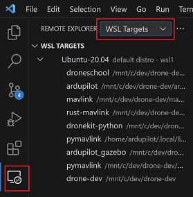  

`Ubuntu-20.04` を右クリックし `Set as Default Distro` を選択しデフォルトに設定します。  
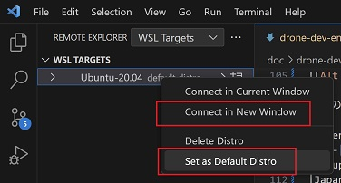

設定したら次は、同じ右クリックメニューの `Connect in New Window` でWSLに接続します。

新しいウィンドウが開き、左下の部分が画像のような接続した状態になっていることを確認します。
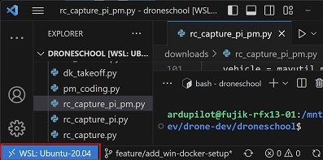

# 5. ArduPilotビルド環境セットアップ
【注意】すでにビルド環境がセットアップ済みの場合スキップしてください。  
## 5.1. ArduPilotソースコードをクローン
Ubuntu 20.04.5 LTSを起動します。
コース毎にクローンするURLを確認します。

【Applicationコース向け】本家リポジトリURL  
  https://github.com/ArduPilot/ardupilot.git

【FlightCodeコース向け】Githubアカウントを作成し、本家ardupilotリポジトリをフォークしてから、自分のアカウントのardupilotリポジトリをクローンするのがよいです。その場合のURLは、
  https://github.com/[自分のGithubアカウント名]/ardupilot.git  
になるはずです。

次のようなコマンドを入力してクローンを実行します。  
※ここでは、Applicationコース向けの本家リポジトリURLを使い、クローン先はhomeディレクトリ `/home/ardupilot` としています。
```bash
cd
```
```bash
git clone https://github.com/ArduPilot/ardupilot.git
```
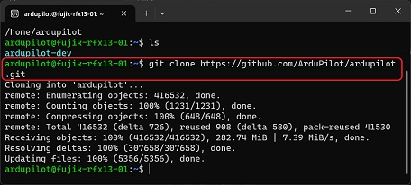  
クローンが完了したら次の環境セットアップスクリプトを実行します。  

## 5.2. セットアップスクリプトで環境をインストール
Ubuntu端末に次のコマンドを順番に実行してビルド環境をインストール＆セットアップしていきます。  
```bash
cd ardupilot
```
```bash
./Tools/environment_install/install-prereqs-ubuntu.sh -y
```
何度かパスワードを要求されるので都度入力します。結構処理に時間がかかるので待ちます。  

# 6. Visual Studio Code拡張機能インストール
Visual Studio Codeを起動し、WSL（Ubuntu-20.04）に接続します。  
メニューを `ファイル` -> `フォルダーを開く` の順に選択し、前項でダウンロードしたardupilotディレクトリ（パス：`/home/ardupilot/ardupilot`）を開きます。  
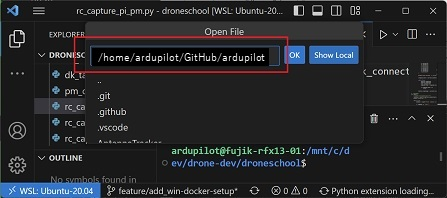  

初回は信頼ダイアログが表示されるので `はい、作成者を信頼します/Yes, I trust the authors` を選択します。  
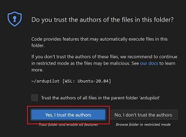

[4. Visual Studio CodeとWSLの連携](#4-visual-studio-codeとwslの連携) の手順を参考にして下記の拡張機能をインストールします。

|Extentions|検索ワード|japanese|
|----|----|----|
|Remote Development|remote dev|リモート開発(Docker/SSH)サポート|
|Japanese Language Pack for Visual Studio Code|japanese|表示の日本語化|
|Python|Python|Python言語サポート|
|C/C++|C++|C/C++言語サポート|
|Lua|Lua|Lua言語サポート|
|Docker|Docker|Dockerサポート|
|ardupilot-devenv|ardupilot|ArduPilot開発サポート|
|Lua Autocomplete for ArduPilot|ardupilot|ArduPilot用Lua言語サポート|

# 7. シミュレータ（SITL）用セットアップ
# 8. シミュレータ（Gazebo）用セットアップ（任意）
## 8.1. Gazeboのインストール
## 8.2. プラグインのインストール
## 8.3. シミュレータの起動
# 9. 【Applicationコース向け】DroneKit Python, pymavlinkセットアップ
## 9.1. DroneKit Python最新のソースコードからインストール
## 9.2. pymavlinkソースコードの取得
## 9.3. 自動補完セットアップ
## 9.4. 動作確認
# 10. 【FlightCodeコース向け】デバッグ環境セットアップ
## 10.1. 必要なパッケージインストール
## 10.2. デバッグ構成を追加
## 10.3. ブレークポイントを置く
## 10.4. デバッグ実行


