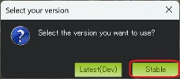
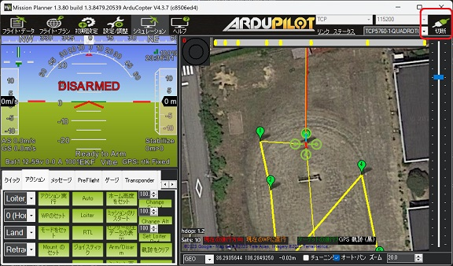
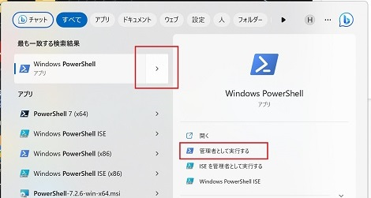
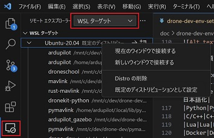

<div align="center">
<h3>ドローンエンジニア養成塾 デベロッパーコース</h3>
<h2>開発環境構築手順書</h2><br>
(Windows10/11 + WSL2(Ubuntu22.04) + Visual Studio Code)<br/>
Ver.1.4.3 - 2024.11.9
</div>

<!--
Ver.1.4.0 - 2023.5.26 - 初版
Ver.1.4.1 - 2023.6.9  - WSLインストール方法変更、PDFレイアウト調整、微修正
Ver.1.4.2 - 2023.7.11 - PDF生成方法修正、画像・コードの改行位置調整
Ver.1.4.3 - 2024.11.9 - WSL2, Ubuntu22.04 前提で手順を修正
-->

Table of Contents
<!-- @import "[TOC]" {cmd="toc" depthFrom=1 depthTo=6 orderedList=false} -->

<!-- code_chunk_output -->

- [1. はじめに](#1-はじめに)
- [2. Mission Planner セットアップ](#2-mission-planner-セットアップ)
  - [2.1. Mission Planner インストール](#21-mission-planner-インストール)
  - [2.2. シミュレータ（Mission Planner）の起動](#22-シミュレータmission-plannerの起動)
  - [2.3. Mission Plannerを使用した機体の基本操作](#23-mission-plannerを使用した機体の基本操作)
    - [2.3.1. アームと離陸](#231-アームと離陸)
    - [2.3.2. ミッション作成と自動飛行](#232-ミッション作成と自動飛行)
- [3. Visual Studio Codeインストール](#3-visual-studio-codeインストール)
- [4. WSLにUbuntuをインストール](#4-wslにubuntuをインストール)
  - [4.1. WSLの有効化設定とバージョン確認](#41-wslの有効化設定とバージョン確認)
  - [4.2. Ubuntu22のインストールと初期設定](#42-ubuntu22のインストールと初期設定)
- [5. Visual Studio CodeとWSLの連携](#5-visual-studio-codeとwslの連携)
  - [5.1. 拡張機能のインストール](#51-拡張機能のインストール)
  - [5.2. 日本語表示の有効化](#52-日本語表示の有効化)
  - [5.3. WSLとの接続](#53-wslとの接続)
- [6. ArduPilotビルド環境セットアップ](#6-ardupilotビルド環境セットアップ)
  - [6.1. ArduPilotソースコードをクローン](#61-ardupilotソースコードをクローン)
  - [6.2. セットアップスクリプトで環境をインストール](#62-セットアップスクリプトで環境をインストール)
- [7. WSL（Ubuntu22.04）へ拡張機能のインストール](#7-wslubuntu2204へ拡張機能のインストール)
- [8. シミュレータ（SITL）用セットアップ](#8-シミュレータsitl用セットアップ)
  - [8.1. シミュレータ動作確認](#81-シミュレータ動作確認)
- [9. 【Applicationコース向け】DroneKit Python, Pymavlinkセットアップ](#9-applicationコース向けdronekit-python-pymavlinkセットアップ)
  - [9.1. GitHubからソースコード取得とインストール](#91-githubからソースコード取得とインストール)
  - [9.2. Visual Studio Code入力補完設定](#92-visual-studio-code入力補完設定)
  - [9.3. 接続確認](#93-接続確認)
    - [9.3.1. DroneKit Python からの確認](#931-dronekit-python-からの確認)
    - [9.3.2. Pymavlink からの確認](#932-pymavlink-からの確認)
- [10. 【FlightCodeコース向け】デバッグ環境セットアップ](#10-flightcodeコース向けデバッグ環境セットアップ)
  - [10.1. 必要なパッケージインストール](#101-必要なパッケージインストール)
  - [10.2. デバッグ構成を追加](#102-デバッグ構成を追加)
  - [10.3. ブレークポイントを置く](#103-ブレークポイントを置く)
  - [10.4. デバッグ実行](#104-デバッグ実行)
- [11. Appendix](#11-appendix)
  - [11.1. Visual Studio Codeショートカットキー](#111-visual-studio-codeショートカットキー)

<!-- /code_chunk_output -->

<div style="page-break-before:always"></div>

# 1. はじめに
本書はWindows10/11 + WSL2（Ubuntu22.04） + Visual Studio Code を使用してArduPilotドローンソフトウェアの開発・テストを行うための環境構築手順です。  
開発環境構成における本書の対象範囲は下図の通りとなります。  
  

<div style="page-break-before:always"></div>  

# 2. Mission Planner セットアップ
## 2.1. Mission Planner インストール
【注意】インストール済みの場合はスキップしてください。  

下記リンクをクリックして最新のインストーラをダウンロードします。  
https://firmware.ardupilot.org/Tools/MissionPlanner/MissionPlanner-latest.msi  

ダウンロードされたインストーラ `MissionPlanner-latest.msi` をダブルクリックします。  

ライセンスに同意して、基本的に`Next`、`Install`、`次へ`、`完了` を押下してインストールを完了させます。  

タスクバーに`Mission Planner`を入力して、Mission Plannerを起動します。  

Altitude Angelダイアログが表示されたら、`No`を押下します。（初回のみ）  

## 2.2. シミュレータ（Mission Planner）の起動
上部メニューの `シミュレーション` を押下して、シミュレーション画面に切り替えます。  
  

ホームポジションを指定するため、Extra command line に `--home 35.879129,140.339683,7,0` （ドローンフィールドKawachiの場所） を入力して、画面下部の `Multirotor` のアイコン を押下します。   
  

Select your versionダイアログが表示されたら、`Stable` を押下します。  
  

シミュレータの実行ファイルがダウンロードが開始され、完了後に起動します。
起動後、フライト・データ画面に切り替わり、機体（シミュレータ）に接続されます。  
  

シミュレータを終了するには、タイトルバーに `ArduCopter.exe` が表示されているターミナルのウィンドウを閉じます。  
  

二回目以降は`Skip Download` にチェックを付けることで、実行ファイルのダウンロードをスキップしてシミュレータを起動できます。  
  

<div style="page-break-before:always"></div>  

## 2.3. Mission Plannerを使用した機体の基本操作
【注意】この手順は機体（シミュレータ）に接続している状態で行ってください。  
### 2.3.1. アームと離陸
上部メニューの `フライト・データ` を押下してフライト・データ画面に切り替えます。  
  

アクションタブを開き、リストボックスから `Guided` を選択して、 `モードをセット` ボタンを押下して、機体のモードをGUIDEDモードに切り替えます。`Arm/Disarm` ボタンを押下して、機体をアームします。  
  
HUDに下記の通り、`ARMED` , `Guided` が表示されていることを確認します。  
  

マップエリアで右クリック → `離陸` を押下 → Enter Altダイアログに `10` を入力して、`OK` を押下します。  


機体が離陸し、高度10メートルまで上昇してホバリングすることを確認します。  
  

<div style="page-break-before:always"></div>  

目的地を指定した自動飛行を行う場合、マップエリアの任意の場所で右クリック → `ここまで飛行` を押下 →  Enter Altダイアログに `10` を入力して、`OK` を押下します。  

  

指定した地点への自動飛行が開始されます。目的地に到達すると機体はホバリングします。  
  

その場で着陸する場合は、リストボックスから `Land` を選択して、 `モードをセット` ボタンを押下します。ホームポジションに戻って着陸する場合は、`RTL` ボタンを押下します。  

<div style="page-break-before:always"></div>  

### 2.3.2. ミッション作成と自動飛行
【注意】この手順は機体（シミュレータ）がホバリングしている状態で行ってください。  

上部メニューの `フライト・プラン` を押下してフライト・プラン画面に切り替えます。  
  

デフォルト高度に`10`を入力します。マップエリアを左クリックしてウェイポイントを追加してミッションを作成します。`WPの書込み` ボタンを押下して、作成したミッションを機体にアップロードします。  
  

上部メニューの `フライト・データ` を押下してフライト・データ画面に切り替えます。  
  

<div style="page-break-before:always"></div>  

アクションタブを開き、`Auto` ボタンを押下して、AUTOモードに切り替えます。  
  

作成したミッションに基づいた自動飛行が開始されます。ミッションが完了すると機体はホバリングします。  
  

ミッションを再実行する場合は、LOITER, GUIDEDなど別のモードに切り替えた後、AUTOモードに切り替えます。  

<div style="page-break-before:always"></div>  

# 3. Visual Studio Codeインストール
【注意】インストール済みの場合はスキップしてください。  

下記サイトを開きます。  
https://code.visualstudio.com/  
`Download for Windows` をクリックするとダウンロードが開始されます。  
ダウンロードされた exeファイル `VSCodeUserSetup-x64-＜バージョン番号＞.exe` をダブルクリックしてインストールを進めてください。

<div style="page-break-before:always"></div>  

基本的に `次へ` 、 `インストール` をクリックしてインストールを進めます。下記の画面では `PATHへの追加` を選択してください。  

  

Visual Studio Codeのインストールが完了したらPCを再起動して次のステップに進みます。

<div style="page-break-before:always"></div>

# 4. WSLにUbuntuをインストール
## 4.1. WSLの有効化設定とバージョン確認
あまり古いバージョンのWindows10だとWSL機能が使えないため念の為バージョンを確認してください。  
確認するためにPowerShellで `winver` を実行して確認してください。 
```powershell
winver
```
下記の画面が表示されます。  
  

WSLをインストールするためには、Windows 10 version 2004(Build 19041)以上、もしくはWindows 11である必要があります。古い場合はWindows10の更新、またはWindows 11のインストールを先に完了してから再度このステップから実行してください。  
社用PCなどセキュリティ対策が施されている場合、仮想化機能が無効化されている場合はセットアップが失敗する可能性があります。自社のテクニカルサポート部門にお問合せください。<br/>
WSLのインストールが可能な条件を満たしている場合次のページのインストールに進んでください。

WSL有効化をするために、PowerShellを管理者権限で開きます。  
タスクバーの検索窓に `PowerShell` を入力して検索します。  
  

<div style="page-break-before:always"></div>

検索結果に表示された `Windows PowerShell` の右側にある `>` ボタンをクリックし、`管理者として実行する` をクリックします。  

  

立ち上がったPowerShellのウィンドウに次の2つのコマンドを順番に実行し、PCを再起動してください。
```powershell
dism.exe /online /enable-feature /featurename:Microsoft-Windows-Subsystem-Linux /all /norestart
```
```powershell
dism.exe /online /enable-feature /featurename:VirtualMachinePlatform /all /norestart
```

PC再起動後、PowerShellを開いて次のコマンドを実行しPowerShellを閉じてください。これでデフォルトのバージョンを1にします。  
デフォルトが1で困る場合は、WSLバージョン2でインストールした後で個別に `wsl --set-version Ubuntu-22.04 1` を実行して変更してください。
```powershell
wsl --set-default-version 2
```
## 4.2. Ubuntu22のインストールと初期設定
【注意】すでにUbuntu22.04がインストール済みの場合はスキップしてください。

PowerShellを開いて次のコマンドを実行して`Ubuntu-22.04`をインストールしてください。
```powershell
wsl --install -d Ubuntu-22.04
```

インストールが完了したら `PCを再起動` をしてください。<br/>
PC起動後の初回起動時 `Installing, this may take a few minutes…` としばらく表示されます。フリーズではないので、そのままインストールが完了するまで待ちます。  
インストールが終わると username と password をきかれるので、下記の通り入力して設定します。必ず半角英字のみで設定します。

* username : `ardupilot`
* password : `ardupilot` 

パスワードは入力してもセキュリティ上表示されませんが入力されています。間違えた場合はバックスペースで消せます。
画像のようになればUbuntuのインストールは完了です。このウィンドウを閉じます。  
  

念の為、WSLのバージョンを確認します。PowerShellを起動し次のコマンドを実行して確認してください。
```powershell
wsl -l -v
```
VERSIONのところが `2` と表示されていれば問題ありません。
```powershell
  NAME                   STATE           VERSION
* Ubuntu-22.04           Running         2
```

> **Note**
> WSLはバージョン1と2を混在させることができます。WSL2はUSB接続を可能にする手順が複雑なため、実機デバイスなどを接続する場合WSL1を推奨します。シミュレータしか使用しない場合はWSL2の方が処理速度が速いのでオススメです。

Ubuntuのインストールが完了したら、Visual Studio Codeと連携するため次のステップに進んでください。  

<div style="page-break-before:always"></div>

# 5. Visual Studio CodeとWSLの連携
【注意】すでに連携済みの場合はスキップしてください。  

Visual Studio Codeを起動します。初回起動時に次のような警告ウィンドウが表示される場合 `アクセスを許可する` を選択してください。  


Visual Studio Codeが起動したら次の手順に進んでください。
## 5.1. 拡張機能のインストール
左側の `Extensions（ブロックのようなアイコン）` を選択し拡張機能をインストールします。検索欄に `remote dev` を入力し検索し `Remote Development` を選択します。詳細画面にある `Install` を選択してください。  


<div style="page-break-before:always"></div>

同様の手順で次の拡張機能もインストールしてください。

|Extentions|検索ワード|japanese|
|----|----|----|
|Japanese Language Pack for Visual Studio Code|japanese|表示の日本語化|
|Python|Python|Python言語サポート|
|C/C++|C++|C/C++言語サポート|
|Lua|Lua|Lua言語サポート|
|Docker|Docker|Dockerサポート|
|ardupilot-devenv|ardupilot|ArduPilot開発サポート|
|Lua Autocomplete for ArduPilot|ardupilot|ArduPilot用Lua言語サポート|

## 5.2. 日本語表示の有効化
`Ctrl + Shift + P` を押して表示される入力エリアに `Configure Di` と入力します。  
表示される候補の中から `Configure Display Language` を選択します。  


その後に表示される候補から `日本語(ja)` を選択します。   


Visual Studio Codeを再起動を促されるので再起動します。起動したら次の手順に進んでください。 
## 5.3. WSLとの接続
画像のように左側の `リモートエクスプローラー（PC画面のようなアイコン）` を選択します。  
画面が変わったら、 `リモートエクスプローラー` を `WSLターゲット` に変更します。画像のようにインストールした `Ubuntu22.04` が表示されているか確認します。WSLに詳しい方はこの通りでなくても問題ありませんのでビルド環境セットアップに進んでください。  
  

`Ubuntu22.04` を右クリックし `既定のディストリビューションとして設定` を選択しデフォルトに設定します。  


設定したら次は、同じ右クリックメニューの `新しいウィンドウで接続する` でWSLに接続します。
新しいウィンドウが開き、左下の部分が画像のような接続した状態になっていることを確認します。  


<div style="page-break-before:always"></div>

# 6. ArduPilotビルド環境セットアップ
【注意】すでにビルド環境がセットアップ済みの場合スキップしてください。  
## 6.1. ArduPilotソースコードをクローン
Ubuntu22.04を起動します。
コース毎にクローンするURLを確認します。

【Applicationコース向け】本家リポジトリURL  
  https://github.com/ArduPilot/ardupilot.git

【FlightCodeコース向け】Githubアカウントを作成し、本家ardupilotリポジトリをフォークしてから、自分のアカウントのardupilotリポジトリをクローンするのがよいです。その場合のURLは、  
  https://github.com/[自分のGithubアカウント名]/ardupilot.git  
になるはずです。

次のコマンドを入力してArduPilotソースコードするディレクトリを作成します。  
```bash
cd
mkdir GitHub
cd GitHub
```
次のコマンドを入力してArduPilotソースコードのクローンを実行します。下記例ではApplicationコース向け本家リポジトリURLを使用しています。  
```bash
git clone https://github.com/ArduPilot/ardupilot.git
```
  
クローンが完了したら次の環境セットアップスクリプトを実行します。  

<div style="page-break-before:always"></div>

## 6.2. セットアップスクリプトで環境をインストール
Ubuntuターミナルに次のコマンドを順番に実行してビルド環境をインストール＆セットアップしていきます。  
```bash
cd /home/ardupilot/GitHub/ardupilot
```
```bash
./Tools/environment_install/install-prereqs-ubuntu.sh -y
```
何度かパスワードを要求されるので都度入力します。処理に時間がかかるので待ちます。  
下記のメッセージが表示されたら完了です。  

```bash
---------- ./Tools/environment_install/install-prereqs-ubuntu.sh end ----------
```

<div style="page-break-before:always"></div>

# 7. WSL（Ubuntu22.04）へ拡張機能のインストール
Visual Studio Codeを起動し、WSL（Ubuntu22.04）に接続します。  
メニューを `ファイル` -> `フォルダーを開く` の順に選択し、前項でダウンロードしたardupilotディレクトリ（パス：`/home/ardupilot/GitHub/ardupilot`）を開きます。  
  

初回は信頼ダイアログが表示されるので `はい、作成者を信頼します` を選択します。  


[Visual Studio CodeとWSLの連携](#5-visual-studio-codeとwslの連携) の手順を参考にして下記の拡張機能をインストールします。

|Extentions|検索ワード|japanese|
|----|----|----|
|Python|Python|Python言語サポート|
|C/C++|C++|C/C++言語サポート|
|Lua|Lua|Lua言語サポート|
|Docker|Docker|Dockerサポート|
|ardupilot-devenv|ardupilot|ArduPilot開発サポート|
|Lua Autocomplete for ArduPilot|ardupilot|ArduPilot用Lua言語サポート|

<div style="page-break-before:always"></div>

# 8. シミュレータ（SITL）用セットアップ
## 8.1. シミュレータ動作確認
Ubuntuターミナルを閉じ、PCを再起動してください。
Ubuntu22.04を起動して次のコマンドを実行してください。
```bash
sim_vehicle.py -v Copter --map --console -L Kawachi
```

セキュリティ警告が表示されたら「アクセスを許可する」を選択してください。  


画像のような表示になれば正しく動作している状態です。  
  

シミュレータが起動している状態でMission Plannerを起動すると自動的にUDPでシミュレータに接続します。  
  

次のページ以降は、コースによって必要なところだけセットアップしてください。  

* [【Applicationコース向け】DroneKit Python, pymavlinkセットアップ](#9-applicationコース向けdronekit-python-pymavlinkセットアップ)  
* [【FlightCodeコース向け】デバッグ環境セットアップ](#10-flightcodeコース向けデバッグ環境セットアップ)

<div style="page-break-before:always"></div>

# 9. 【Applicationコース向け】DroneKit Python, Pymavlinkセットアップ
【注意】セットアップ済みの場合はスキップしてください。
## 9.1. GitHubからソースコード取得とインストール
シミュレータ、Ubuntu22.04、Visual Studio Codeを全部終了してください。次にVisual Studio Codeを起動しWSL（Ubuntu22.04）に接続します。

メニュー `ターミナル` → `新しいターミナル` をクリックしてターミナルを起動します。  
下記コマンドを実行してGitHubから開発ツール、教材のソースコードを取得します。
```bash
cd /home/ardupilot/GitHub
git clone https://github.com/tajisoft/droneschool
git clone https://github.com/dronekit/dronekit-python
git clone https://github.com/intel/mavlink-router
git clone https://github.com/ArduPilot/pymavlink
cd pymavlink
git clone https://github.com/ArduPilot/mavlink
```
下記コマンドを実行して各開発ツールをインストールします。パスワードを要求されたら都度入力してください。
```bash
# DroneKit Python
cd  /home/ardupilot/GitHub/dronekit-python
pip install --user .
# Pymavlink
cd  /home/ardupilot/GitHub/pymavlink
pip install --user .
# MAVLink Router
cd  /home/ardupilot/GitHub/mavlink-router
git submodule update --init --recursive
sudo apt update
sudo apt install -y git meson ninja-build pkg-config gcc g++ systemd
meson setup build . 
ninja -C build 
sudo ninja -C build install
```

<div style="page-break-before:always"></div>

## 9.2. Visual Studio Code入力補完設定
Visual Studio Codeを開いて、メニュー `ファイル` → `ユーザ設定` → `設定` の順に選択します。下記画面右上の設定ファイルアイコンをクリックします。  
  

下記の設定を追加します。既存の設定がすでにある場合はご自身の環境に合わせて設定してください。  
```json
{
    "python.autoComplete.extraPaths": [
        "/home/ardupilot/GitHub/pymavlink",
        "/home/ardupilot/GitHub/dronekit-python"
    ],
    "python.analysis.extraPaths": [
        "/home/ardupilot/GitHub/pymavlink",
        "/home/ardupilot/GitHub/dronekit-python"
    ],
    ～省略～
}
```

<div style="page-break-before:always"></div>

入力補完の動作確認をするために `ファイル` → `新規ファイル` を選択してください。  
  

次に、新規ファイルウィンドウ部分にフォーカスし `Ctrl + s` で保存メニューを表示してください。`/home/ardupilot/test.py` となるように保存します。   
  

画像のようにソースコードを入力した際に補完候補が表示されるようになっていればセットアップ完了です。  
* DroneKit Python  
   

* pymavlink  
  

<div style="page-break-before:always"></div>

## 9.3. 接続確認

Visual Studio Codeを起動し、WSL（Ubuntu22.04）に接続します。  
メニューを ファイル -> フォルダーを開く の順に選択し、前項でダウンロードしたardupilotディレクトリ（パス：`/home/ardupilot/GitHub`）を開きます。  
[2.2. シミュレータ（Mission Planner）の起動](#22-シミュレータmission-plannerの起動) 、または [8.1. シミュレータ動作確認](#81-シミュレータ動作確認) の手順を参照してシミュレータを起動しておきます。  
PowerShellを起動し、`ipconfig`コマンドを実行して、シミュレータが起動しているPCのIPアドレスを調べておきます。

  

<div style="page-break-before:always"></div>

### 9.3.1. DroneKit Python からの確認
Visual Studio Codeのエクスプローラーから `GitHub/droneschool/dronekit_scripts/011_connect.py` を開きます。
ソースコード4～5行目 の接続先を `tcp:＜PCのIPアドレス＞:5762` に修正します。

右上の`▷アイコン`をクリックします。ターミナルが起動し、Pythonスクリプトが実行されます。  
機体（シミュレータ）から受信した機体情報（対地速度、対空速度、モード、アーム状態、など）が一定間隔で表示されることを確認します。  
  

`Ctrl+C`で終了します。

<div style="page-break-before:always"></div>

### 9.3.2. Pymavlink からの確認
Visual Studio Codeのエクスプローラーから `GitHub/droneschool/pymavlink_scripts/pm01_message_dump.py` を開きます。
ソースコード4～5行目 の接続先を `tcp:＜PCのIPアドレス＞:5762` に修正します。

右上の`▷アイコン`をクリックします。ターミナルが起動し、Pythonスクリプトが実行されます。  
機体（シミュレータ）から受信したMAVLinkメッセージが一定間隔で表示されることを確認します。  
  

`Ctrl+C`で終了します。

<div style="page-break-before:always"></div>


# 10. 【FlightCodeコース向け】デバッグ環境セットアップ
【注意】セットアップ済みの場合はスキップしてください。
## 10.1. 必要なパッケージインストール
Ubuntu22.04を起動し次のコマンドを実行してください。  
```bash
sudo apt install gdb -y
```
## 10.2. デバッグ構成を追加
ArduPilotのソースコードを開きます。メニュー `ファイル` → `フォルダーを開く…` → `/home/ardupilot/GitHub/ardupilot`と入力 を選択してください。  
任意のcppファイルを開いている状態で、メニュー `実行` → `構成の追加…` を選択してください。  
  

<div style="page-break-before:always"></div>

表示された `launch.json` の右下 `構成の追加` ボタンをクリックします。
追加された構成を次のように修正して保存ください。 
```json
    "version": "0.2.0",
    "configurations": [
        {
            "name": "(gdb) ArduCopter",
            "type": "cppdbg",
            "request": "attach",
            "program": "${workspaceFolder}/build/sitl/bin/arducopter",
            "MIMode": "gdb",
            "setupCommands": [
                {
                    "description": "gdb の再フォーマットを有効にする",
                    "text": "-enable-pretty-printing",
                    "ignoreFailures": true
                },
                {
                    "description": "逆アセンブリ　フレーバーを Intel に設定",
                    "text": "-gdb-set disassembly-flavor intel",
                    "ignoreFailures": true
                }
            ]
        }
    ] 
```

<div style="page-break-before:always"></div>

## 10.3. ブレークポイントを置く
一般的なデバッグ手法のやり方として、任意の処理行で一時停止するためのブレークポイントを配置することができます。ブレークポイントは複数設定できます。

ここでは例として、`ArduCopter/mode_stabilize.cpp` のソースコードファイルを開き、画像のように行番号の左側をクリックしてブレークポイントを配置してください。  
  

<div style="page-break-before:always"></div>

## 10.4. デバッグ実行
Visual Studio Codeのターミナルから次のコマンドを1度だけ実行してください。
デバッグのたびに実行する必要はありません。ただし、再起動時は再度実行する必要があります。  
```bash
echo 0 | sudo tee /proc/sys/kernel/yama/ptrace_scope
```

次にシミュレータを次のコマンドで起動します。  
```bash
sim_vehicle.py -v Copter --console --map -D -L Kawachi
```
  
  

メニュー `実行` → `デバッグの開始` を選択してください。  
  

`arducopter` プロセスを選択してください。  
  

プロセスにアタッチされ、デバッグアイコンメニュー画面は画像のような表示になります。
  

GDBを利用したデバッグについて知りたい場合は、下記を参照してください。  
https://ardupilot.org/dev/docs/debugging-with-gdb-using-vscode.html

<div style="page-break-before:always"></div>

# 11. Appendix
## 11.1. Visual Studio Codeショートカットキー
英語：https://code.visualstudio.com/shortcuts/keyboard-shortcuts-windows.pdf
