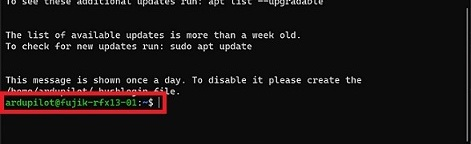
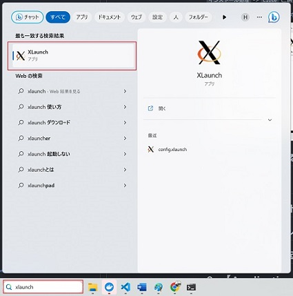
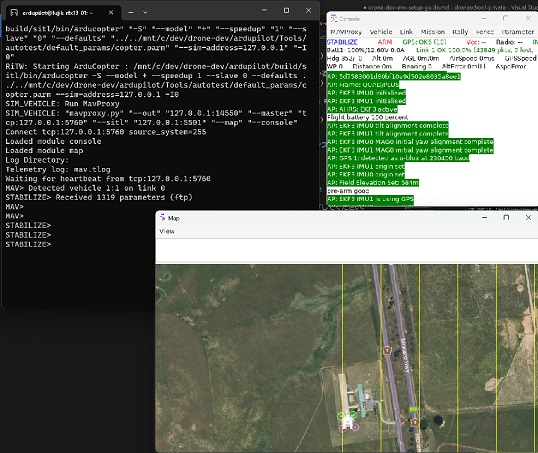

開発環境構築  
Windows10 / 11  
WSL(Windows SubSystem for Linux)  
Visual Studio Code

2023.5.26  
Ver.1.4.0

Table of Contents
- [1. Visual Studio Codeインストール](#1-visual-studio-codeインストール)
- [2. WSLにUbuntuをインストール](#2-wslにubuntuをインストール)
  - [2.1. WSLの有効化設定とバージョン確認](#21-wslの有効化設定とバージョン確認)
- [3. Ubuntu20のインストールと初期設定](#3-ubuntu20のインストールと初期設定)
- [4. Visual Studio CodeとWSLの連携](#4-visual-studio-codeとwslの連携)
  - [4.1. 拡張機能のインストール](#41-拡張機能のインストール)
  - [4.2. 日本語表示の有効化](#42-日本語表示の有効化)
  - [4.3. WSLとの接続](#43-wslとの接続)
- [5. ArduPilotビルド環境セットアップ](#5-ardupilotビルド環境セットアップ)
  - [5.1. ArduPilotソースコードをクローン](#51-ardupilotソースコードをクローン)
  - [5.2. セットアップスクリプトで環境をインストール](#52-セットアップスクリプトで環境をインストール)
- [6. WSL（Ubuntu20）へ拡張機能のインストール](#6-wslubuntu20へ拡張機能のインストール)
- [7. シミュレータ（SITL）用セットアップ](#7-シミュレータsitl用セットアップ)
  - [7.1. GUI表示のためのセットアップ](#71-gui表示のためのセットアップ)
  - [7.2. シミュレータ動作確認](#72-シミュレータ動作確認)
- [8. シミュレータ（Gazebo）用セットアップ（任意）](#8-シミュレータgazebo用セットアップ任意)
  - [8.1. Gazeboのインストール](#81-gazeboのインストール)
  - [8.2. プラグインのインストール](#82-プラグインのインストール)
  - [8.3. シミュレータの起動](#83-シミュレータの起動)
- [9. 【Applicationコース向け】DroneKit Python, pymavlinkセットアップ](#9-applicationコース向けdronekit-python-pymavlinkセットアップ)
  - [9.1. DroneKit Python最新のソースコードからインストール](#91-dronekit-python最新のソースコードからインストール)
  - [9.2. pymavlinkソースコードの取得](#92-pymavlinkソースコードの取得)
  - [9.3. 自動補完セットアップ](#93-自動補完セットアップ)
  - [9.4. 動作確認](#94-動作確認)
- [10. 【FlightCodeコース向け】デバッグ環境セットアップ](#10-flightcodeコース向けデバッグ環境セットアップ)
  - [10.1. 必要なパッケージインストール](#101-必要なパッケージインストール)
  - [10.2. デバッグ構成を追加](#102-デバッグ構成を追加)
  - [10.3. ブレークポイントを置く](#103-ブレークポイントを置く)
  - [10.4. デバッグ実行](#104-デバッグ実行)
- [Appendix](#appendix)
  - [Visual Studio Codeショートカットキー](#visual-studio-codeショートカットキー)


# 1. Visual Studio Codeインストール
【注意】インストール済みの場合はスキップしてください。  
下記サイトを開きます。  
https://code.visualstudio.com/  
`Download for Windows Stable Build` をクリックするとダウンロードが開始されます。  
ダウンロードされた exeファイル `VSCodeUserSetup-x64-＜バージョン番号＞.exe` をダブルクリックしてインストールを進めてください。
  
基本的に `次へ` 、 `インストール` をクリックしてインストールを進めます。下記の画面では `PATHへの追加` を選択してください。
  

Visual Studio Codeのインストールが完了したらPCを再起動して次のステップに進みます。

# 2. WSLにUbuntuをインストール
## 2.1. WSLの有効化設定とバージョン確認
あまり古いバージョンのWindows10だとWSL機能が使えないため念の為バージョンを確認してください。  
確認するためにPowerShellで `winver` を実行して確認してください。 
```powershell
winver
```
下記の画面が表示されます。  
  
WSLをインストールするためには、Windows 10 version 2004(Build 19041)以上、もしくはWindows 11である必要があります。古い場合はWindows10の更新、またはWindows 11のインストールを先に完了してから再度このステップから実行してください。  
社用PCなどセキュリティ対策が施されている場合、仮想化機能が無効化されている場合はセットアップが失敗する可能性があります。自社のテクニカルサポート部門にお問合せください。  

WSL有効化をするために、PowerShellを管理者権限で開きます。  
タスクバーの検索窓に `PowerShell` と入力します。検索結果 `Windows PowerShell` の右側にある `>` ボタンをクリックし、`管理者として実行する` をクリックします。  
  

立ち上がったPowerShellのウィンドウに次の2つのコマンドを順番に実行し、PCを再起動してください。
```powershell
dism.exe /online /enable-feature /featurename:Microsoft-Windows-Subsystem-Linux /all /norestart
```
```powershell
dism.exe /online /enable-feature /featurename:VirtualMachinePlatform /all /norestart
```

PC再起動後、PowerShellを開いて次のコマンドを実行しPowerShellを閉じてください。これでデフォルトのバージョンを1にします。  
デフォルトが1で困る場合は、2でインストールした後で `wsl --set-version Ubuntu-20.04 1` を実行して変更してください。
```powershell
wsl --set-default-version 1
```

# 3. Ubuntu20のインストールと初期設定
【注意】すでにUbuntu 20.04.5がインストール済みの場合はスキップしてください。

Windowsストアアプリを開き `ubuntu` と検索し `Ubuntu 20.04.6 LTS` を選択してください。
Ubuntu 20.04 LTSの詳細画面が表示されたら `入手` を選択しダウンロードおよびインストールしてください。  
  

インストールが完了したら `開く` を選択してください。画面を閉じてしまった場合は、Windowsメニューから `Ubuntu 20.04.6 LTS` を選択して起動してください。  
  

初回起動時 `Installing, this may take a few minutes…` としばらく表示されます。フリーズではないので、そのままインストールが完了するまで待ちます。  
インストールが終わると password と password をきかれるので、下記の通り入力して設定します。必ず半角英字のみで設定します。

* username : `ardupilot`
* password : `ardupilot` 

パスワードは入力してもセキュリティ上表示されませんが入力されています。間違えた場合はバックスペースで消せます。
画像のようになればUbuntuのインストールは完了です。このウィンドウを閉じます。  
  

念の為、WSLのバージョンを確認します。PowerShellを起動し次のコマンドを実行して確認してください。
```powershell
wsl -l -v
```
VERSIONのところが `1` と表示されていれば問題ありません。
```powershell
  NAME                   STATE           VERSION
* Ubuntu-20.04           Running         1
```

> **Note**
> WSLはバージョン1と2を混在させることができます。WSL2はUSB接続を可能にする手順が複雑なため、実機デバイスなどを接続する場合WSL1を推奨します。シミュレータしか使用しない場合はWSL2の方が処理速度が速いのでオススメです。

Ubuntuのインストールが完了したら、Visual Studio Codeと連携するため次のステップに進んでください。
# 4. Visual Studio CodeとWSLの連携
【注意】すでに連携済みの場合はスキップしてください。  

Visual Studio Codeを起動します。初回起動時に次のような警告ウィンドウが表示される場合 `アクセスを許可する` を選択してください。  


Visual Studio Codeが起動したら次の手順に進んでください。
## 4.1. 拡張機能のインストール
左側の `Extensions（ブロックのようなアイコン）` を選択し拡張機能をインストールします。検索欄に `remote dev` を入力し検索し `Remote Development` を選択します。詳細画面にある `Install` を選択してください。  


同様の手順で次の拡張機能もインストールしてください。

|Extentions|検索ワード|japanese|
|----|----|----|
|Japanese Language Pack for Visual Studio Code|japanese|表示の日本語化|
|Python|Python|Python言語サポート|
|C/C++|C++|C/C++言語サポート|
|Lua|Lua|Lua言語サポート|
|Docker|Docker|Dockerサポート|
|ardupilot-devenv|ardupilot|ArduPilot開発サポート|
|Lua Autocomplete for ArduPilot|ardupilot|ArduPilot用Lua言語サポート|

## 4.2. 日本語表示の有効化
`Ctrl + Shift + P` を押して表示される入力エリアに `Configure Di` と入力します。  
表示される候補の中から `Configure Display Language` を選択します。  


その後に表示される候補から `日本語(ja)` を選択します。   


Visual Studio Codeを再起動を促されるので再起動します。起動したら次の手順に進んでください。 
## 4.3. WSLとの接続
画像のように左側の `リモートエクスプローラー（PC画面のようなアイコン）` を選択します。  
画面が変わったら、 `リモートエクスプローラー` を `WSLターゲット` に変更します。画像のようにインストールした `Ubuntu-20.04` が表示されているか確認します。WSLに詳しい方はこの通りでなくても問題ありませんのでビルド環境セットアップに進んでください。  
  

`Ubuntu-20.04` を右クリックし `既定のディストリビューションとして設定` を選択しデフォルトに設定します。  


設定したら次は、同じ右クリックメニューの `新しいウィンドウで接続する` でWSLに接続します。
新しいウィンドウが開き、左下の部分が画像のような接続した状態になっていることを確認します。  


# 5. ArduPilotビルド環境セットアップ
【注意】すでにビルド環境がセットアップ済みの場合スキップしてください。  
## 5.1. ArduPilotソースコードをクローン
Ubuntu 20.04.5 LTSを起動します。
コース毎にクローンするURLを確認します。

【Applicationコース向け】本家リポジトリURL  
  https://github.com/ArduPilot/ardupilot.git

【FlightCodeコース向け】Githubアカウントを作成し、本家ardupilotリポジトリをフォークしてから、自分のアカウントのardupilotリポジトリをクローンするのがよいです。その場合のURLは、  
  https://github.com/[自分のGithubアカウント名]/ardupilot.git  
になるはずです。

次のようなコマンドを入力してクローンを実行します。  
※ここでは、Applicationコース向けの本家リポジトリURLを使い、クローン先はhomeディレクトリ `/home/ardupilot` としています。
```bash
cd
```
```bash
git clone https://github.com/ArduPilot/ardupilot.git
```
  
クローンが完了したら次の環境セットアップスクリプトを実行します。  

## 5.2. セットアップスクリプトで環境をインストール
Ubuntu端末に次のコマンドを順番に実行してビルド環境をインストール＆セットアップしていきます。  
```bash
cd ardupilot
```
```bash
./Tools/environment_install/install-prereqs-ubuntu.sh -y
```
何度かパスワードを要求されるので都度入力します。結構処理に時間がかかるので待ちます。  

# 6. WSL（Ubuntu20）へ拡張機能のインストール
Visual Studio Codeを起動し、WSL（Ubuntu-20.04）に接続します。  
メニューを `ファイル` -> `フォルダーを開く` の順に選択し、前項でダウンロードしたardupilotディレクトリ（パス：`/home/ardupilot/ardupilot`）を開きます。  
  

初回は信頼ダイアログが表示されるので `はい、作成者を信頼します` を選択します。  


[4. Visual Studio CodeとWSLの連携](#4-visual-studio-codeとwslの連携) の手順を参考にして下記の拡張機能をインストールします。

|Extentions|検索ワード|japanese|
|----|----|----|
|Remote Development|remote dev|リモート開発(Docker/SSH)サポート|
|Japanese Language Pack for Visual Studio Code|japanese|表示の日本語化|
|Python|Python|Python言語サポート|
|C/C++|C++|C/C++言語サポート|
|Lua|Lua|Lua言語サポート|
|Docker|Docker|Dockerサポート|
|ardupilot-devenv|ardupilot|ArduPilot開発サポート|
|Lua Autocomplete for ArduPilot|ardupilot|ArduPilot用Lua言語サポート|

# 7. シミュレータ（SITL）用セットアップ
## 7.1. GUI表示のためのセットアップ
【注意】すでにセットアップ済みの場合はスキップしてください。

下記URLから必要なアプリをダウンロードします。  
https://sourceforge.net/projects/vcxsrv/

`Download` ボタンを押下し `VcXsrv Windows X Server` をダウンロードしてからインストールします。
インストールは、`Next` -> `Install` -> `インストール処理` -> `Close` と選択していけばできます。

インストール完了後、スタートボタンで `XLaunch`  と検索しXLaunchアプリを起動します。  
  

デフォルトのままで「次へ」を選択してください。  
  

`Disable access control` にチェックを忘れないようにします。  
  

自動起動設定のために `Save configuration` を選択し設定ファイルを一旦任意の場所に保存してください。`完了` を選択してください。  
  

セキュリティダイアログが表示されたら、パブリックネットワークも必ずチェックしてから `アクセスを許可する` を選択してください。  
  

キーボードのWinキー＋rを押して `ファイル名を指定して実行` ウィンドウを開き、次の文字列を入力して `OK` を選択してください。
```
shell:startup
```

前のステップで保存したXLaunchの設定ファイルを開いたフォルダに移動します。  
  

次に、Ubuntu 20.04.6 LTS を起動して、次のコマンドを実行してから閉じてください。
```bash
echo "export DISPLAY=localhost:0.0" >> ~/.bashrc
```

コマンド実行後、次のコマンドでファイルに正しく書き込まれていることを確認します。
```bash
cat ~/.bashrc
```

下記のような設定が2行追加されていることを確認します。追加されていない場合は手動で修正してください。
```bash
source /mnt/c/dev/drone-dev/ardupilot/Tools/completion/completion.bash
export DISPLAY=localhost:0.0
```

## 7.2. シミュレータ動作確認
Ubuntu端末を閉じ、PCを再起動してください。
再起動後、タスクトレイに画像のようなアイコンが表示されていることを確認してください。  
  

Ubuntu 20.04.6 LTSを起動して次のコマンドを実行してください。
```bash
sim_vehicle.py -v Copter --map --console
```

セキュリティ警告が表示されたら「アクセスを許可する」を選択してください。  


画像のような表示になれば正しく動作している状態です。  
  

シミュレータが起動している状態でMission Plannerを起動すると自動的にUDPでシミュレータに接続します。  
  

# 8. シミュレータ（Gazebo）用セットアップ（任意）
## 8.1. Gazeboのインストール
## 8.2. プラグインのインストール
## 8.3. シミュレータの起動
# 9. 【Applicationコース向け】DroneKit Python, pymavlinkセットアップ
【注意】セットアップ済みの場合はスキップしてください。
## 9.1. DroneKit Python最新のソースコードからインストール
シミュレータ、Ubuntu 20.04.6、Visual Studio Codeを全部終了してください。次にVisual Studio Codeを起動しWSLに接続します。

メニュー `ターミナル` → `新しいターミナル` を選択します。
ターミナルタブに次のコマンドを順番に実行してください。
```bash
cd
```
```bash
git clone https://github.com/dronekit/dronekit-python
```
```bash
cd dronekit-python
```
```bash
pip3 install . --user
```
下記のような実行結果になれば正常にインストールが完了しています。  
```bash
Requirement already satisfied: monotonic>=1.3 in /home/ardupilot/.local/lib/
～省略～
Successfully built dronekit
Installing collected packages: dronekit
  Attempting uninstall: dronekit
    Found existing installation: dronekit 2.9.2
    Uninstalling dronekit-2.9.2:
      Successfully uninstalled dronekit-2.9.2
Successfully installed dronekit-2.9.2
```
## 9.2. pymavlinkソースコードの取得
自動補完用にpymavlinkのソースコードを取得します。ターミナルタブに次のコマンドを入力して実行してください。
```bash
cd
```
```bash
git clone https://github.com/ArduPilot/pymavlink
```
次のステップに進んで、自動補完のセットアップをしてください。

## 9.3. 自動補完セットアップ
メニュー `ファイル` → `ユーザ設定` → `設定` の順に選択します。下記画面右上の設定ファイルアイコンをクリックします。  
  

下記の設定を追加します。既存の設定がすでにある場合はご自身の環境に合わせて設定してください。  
※ DroneKit Python, pymavlink のクローン先が `/home/ardupilot` の場合です。異なる場合は適宜修正してください。
```json
{
    "python.autoComplete.extraPaths": [
        "/home/ardupilot/pymavlink",
        "/home/ardupilot/dronekit-python"
    ],
    "python.analysis.extraPaths": [
        "/home/ardupilot/pymavlink",
        "/home/ardupilot/dronekit-python"
    ],
    ～省略～
}
```

## 9.4. 動作確認
自動補完の動作確認をするために `ファイル` → `新規ファイル` を選択してください。  
  

次に、新規ファイルウィンドウ部分にフォーカスし `Ctrl + s` で保存メニューを表示してください。`/home/ardupilot/test.py` となるように保存します。   
  

画像のようにソースコードを入力した際に補完候補が表示されるようになっていればセットアップ完了です。  
* DroneKit Python  
   

* pymavlink  
  

# 10. 【FlightCodeコース向け】デバッグ環境セットアップ
【注意】セットアップ済みの場合はスキップしてください。
## 10.1. 必要なパッケージインストール
Ubuntu 20.04.6を起動し次のコマンドを実行してください。  
```bash
sudo apt install gdb -y
```
## 10.2. デバッグ構成を追加
ArduPilotのソースコードを開きます。メニュー `ファイル` → `フォルダーを開く…` を選択してください。  
任意のcppファイルを開いている状態で、メニュー `実行` → `構成の追加…` を選択してください。  
  

表示された `launch.json` の右下 `構成の追加` ボタンをクリックします。
追加された構成を次のように修正して保存ください。 
```json
    "version": "0.2.0",
    "configurations": [
        {
            "name": "(gdb) ArduCopter",
            "type": "cppdbg",
            "request": "attach",
            "program": "${workspaceFolder}/build/sitl/bin/arducopter",
            "MIMode": "gdb",
            "setupCommands": [
                {
                    "description": "gdb の再フォーマットを有効にする",
                    "text": "-enable-pretty-printing",
                    "ignoreFailures": true
                },
                {
                    "description": "逆アセンブリ　フレーバーを Intel に設定",
                    "text": "-gdb-set disassembly-flavor intel",
                    "ignoreFailures": true
                }
            ]
        }
    ] 
```

## 10.3. ブレークポイントを置く
一般的なデバッグ手法のやり方として、任意の処理行で一時停止するためのブレークポイントを配置することができます。ブレークポイントは複数設定できます。

ここでは例として、`ArduCopter/mode_stabilize.cpp` のソースコードファイルを開き、画像のように行番号の左側をクリックしてブレークポイントを配置してください。  
  

## 10.4. デバッグ実行
Visual Studio Codeのターミナルから次のコマンドを1度だけ実行してください。
デバッグのたびに実行する必要はありません。ただし、再起動時は再度実行する必要があります。  
```bash
echo 0 | sudo tee /proc/sys/kernel/yama/ptrace_scope
```

次にシミュレータを次のコマンドで起動します。  
```bash
sim_vehicle.py -v Copter --console --map -D
```
  
  

メニュー `実行` → `デバッグの開始` を選択してください。  
  

`arducopter` プロセスを選択してください。  
  

プロセスにアタッチされ、デバッグアイコンメニュー画面は画像のような表示になります。
  

GDBを利用したデバッグについて知りたい場合は、下記を参照してください。  
https://ardupilot.org/dev/docs/debugging-with-gdb-using-vscode.html

# Appendix
## Visual Studio Codeショートカットキー
英語：https://code.visualstudio.com/shortcuts/keyboard-shortcuts-windows.pdf
