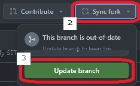

## ドローンエンジニア養成塾 masterブランチから最新資材を取得する手順

### 1. はじめに
   - 本手順は、教材リポジトリ [hfujikawa77/droneschool](https://github.com/hfujikawa77/droneschool) に追加・更新された最新資材を、各自の作業環境に取り込むための手順です。
   - 前提として、各自はドローン開発環境構築手順書（`drone-dev-env-setup-guide.pdf`）の「9.4. 課題提出用GitHubリポジトリ準備」に従い、教材リポジトリを自分のアカウントにフォークし、ワークブランチ（例: `＜term_no＞_＜fname-lname＞`）で作業している状態とします。
   - 用語の整理
      - **origin** : 自分のアカウントにフォークしたリポジトリ（`＜あなたのGitHubアカウント名＞/droneschool`）
      - **upstream** : 教材の本線リポジトリ（`hfujikawa77/droneschool`）
   - 最新資材は **upstream の `master` ブランチ** に追加されます。これを自分のワークブランチに取り込みます。

### 2. 事前確認
   1. VS Codeを起動し、WSL（Ubuntu22.04）に接続します。
   1. メニュー `ターミナル` → `新しいターミナル` をクリックして、ターミナルを起動します。
   1. 教材リポジトリのディレクトリに移動します。
      ```bash
      cd /home/ardupilot/GitHub/droneschool
      ```
   1. 変更途中の作業（コミットしていない変更）が無いことを確認します。
      ```bash
      git status
      ```
      - 未コミットの変更がある場合は、先にコミットするか退避（`git stash`）してから次に進んでください。

### 3. upstream（本線リポジトリ）の登録 ※初回のみ
   1. 本線リポジトリが `upstream` として登録されているか確認します。
      ```bash
      git remote -v
      ```
   1. `upstream` が表示されない場合は、下記コマンドで登録します。（登録済みの場合はスキップ）
      ```bash
      git remote add upstream https://github.com/hfujikawa77/droneschool.git
      git remote -v    # upstream が追加されたことを確認
      ```

### 4. 最新資材の取得とワークブランチへの取り込み
   1. 本線リポジトリの最新の内容を取得します。
      ```bash
      git fetch upstream
      ```
   1. 自分のワークブランチにいることを確認します。`＜fname-lname＞` はご自身の氏名に置き換えてください。
      ```bash
      git checkout ＜term_no＞_＜fname-lname＞
      git branch    # * が付いているブランチが現在のブランチ
      ```
   1. 本線 `master` の最新資材を、自分のワークブランチに取り込みます。
      ```bash
      git merge upstream/master
      ```
   1. （任意）取り込んだ内容を自分のフォーク（origin）にもプッシュして反映します。
      ```bash
      git push origin ＜term_no＞_＜fname-lname＞
      ```

<div style="page-break-before:always"></div>

### 5. コンフリクト（競合）が発生した場合
   1. 自分が変更したファイルと、本線で更新されたファイルが重なると、マージ時にコンフリクトが発生することがあります。
   1. `git status` で競合しているファイルを確認します。
      ```bash
      git status
      ```
   1. VS Codeで該当ファイルを開き、`<<<<<<<` / `=======` / `>>>>>>>` のマーカー部分を確認して、正しい内容に手動で修正します。
   1. 修正後、変更をステージングしてマージを完了します。
      ```bash
      git add ＜競合したファイル＞
      git commit          # マージコミットを作成
      ```
   1. マージを途中で中止して元の状態に戻したい場合は、下記コマンドを実行します。
      ```bash
      git merge --abort
      ```

### 6. 補足：GitHubのSync forkを使う方法
   ターミナル操作を使わず、GitHubの画面操作で最新資材を取り込むこともできます。
   1. Webブラウザで自分のフォークしたリポジトリ `https://github.com/＜あなたのGitHubアカウント名＞/droneschool` を開き、ブランチ `master` を選択します。
   1. `Sync fork` ボタンをクリックし、続けて `Update branch` ボタンをクリックします。本線の最新の変更が自分のフォークの `master` に取り込まれます。  
   
   1. ローカルの `master` を更新し、ワークブランチに取り込みます。
      ```bash
      cd /home/ardupilot/GitHub/droneschool
      git checkout master
      git pull origin master
      git checkout ＜term_no＞_＜fname-lname＞
      git merge master
      ```
