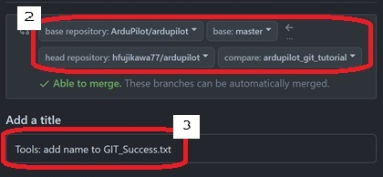

## ドローンエンジニア養成塾 Pull Request作成演習（ローカル版）
### 1. はじめに
   - 本演習はArduPilotプロジェクトへの貢献手段を学ぶため、練習用ファイル`Git_Success.txt` に簡単な修正をしてPull Requestを作成します。[ArduPilot WikiのGitチュートリアル](https://ardupilot.org/dev/docs/git-branch.html) をベースとしています。  
   
   - GitHubアカウントを持ってない人は、[アカウント作成手順](https://docs.github.com/ja/get-started/start-your-journey/creating-an-account-on-github) を参照して作成してください。
   - ドローン開発環境構築手順書（`drone-dev-env-setup-guide.pdf`）でセットアップ済みのPCを使用してください。

### 2. リポジトリのフォーク
   1. Webブラウザで[ArduPilotリポジトリ](https://github.com/ardupilot/ardupilot)にアクセスします。
   1. ページ右上の`Fork`ボタンをクリックして、リポジトリを自分のアカウントにフォークします。  
   

### 3. リポジトリのクローン or リモート切替
   1. VS Codeを起動し、WSL（Ubuntu22.04）に接続します。
   1. メニュー`ターミナル`→`新しいターミナル`をクリックして、ターミナルを起動します。
   1. ArduPilot本線リポジトリからクローン済/未済によって下記のいずれかの手順を実施してください。
      1. クローン済みの場合、リモートリポジトリを切り替えます。
            ```bash
            cd /home/ardupilot/GitHub/ardupilot
            git remote set-url origin https://github.com/＜GitHubアカウント名＞/ardupilot.git
            git remote add upstream https://github.com/ardupilot/ardupilot.git
            git remote -v    # 変更が反映されていることを確認
            ```
      1. クローン未済の場合、フォークしたリポジトリをクローンします。
            ```bash
            cd
            git clone https://github.com/＜GitHubアカウント名＞/ardupilot.git
         ``` 
   1. VS Codeのメニュー`ファイル`→`フォルダを開く` でクローンしたArduPilotリポジトリのディレクトリ`/home/ardupilot/GitHub/ardupilot`を開きます。

<div style="page-break-before:always"></div>

### 4. ワークブランチ作成&チェックアウト
   1. VS Codeのターミナルで下記コマンドを実行して、`master`ブランチからワークブランチを作成してチェックアウトします。 
      ```bash
      git checkout master # masterブランチに切り替える
      git pull upstream master # 最新のmasterブランチを取得
      git checkout -b ardupilot_git_tutorial 
      git branch # 変更が反映されていることを確認
      ```
### 5. ファイル変更とコミット&プッシュ
   1. VS Codeで `Tools/GIT_Test/GIT_Success.txt` ファイルを開きます。
   1. ファイル末尾に自分の名前（firstname lastname）を追加して、`Ctrl + S`をクリックして変更を保存します。   
      
   3. VS Codeのターミナルで下記コマンドを実行してローカルリポジトリに変更をコミットします。
      ```bash
      git add Tools/GIT_Test/GIT_Success.txt # 変更をステージングエリアに追加
      git commit -m "Tools: add name to GIT_Success.txt" # コミット
      ```
   4. 下記コマンドを実行してリモートリポジトリに変更をプッシュします。
      ```bash
      git push origin ardupilot_git_tutorial
      ```
      - name, email未設定エラーが発生したら、下記コマンドを実行して設定します。
         ```bash
         git config --global user.name "Your Name"
         git config --global user.email "you@example.com"
         ```
<div style="page-break-before:always"></div>

### 6. Pull Requestの作成
   1. WebブラウザでフォークしたArduPilotリポジトリのページ `https://github.com/＜GitHubアカウント名＞/ardupilot` を開き、`Compare & pull request`ボタンをクリックします。  
   
   1. 比較するベースとなるリポジトリとブランチ、そして自分のフォークしたリポジトリとブランチを選択します。
       - **base repository**: `Ardupilot/ardupilot`
       - **base**: `master`
       - **head repository**: `＜GitHubアカウント名＞/ardupilot`
       - **compare**: `ardupilot_git_tutorial`
   1. タイトルと本文を以下のように入力します。
      ```
      Tools: add name to GIT_Success.txt
      ```
      
   1. `Create pull request`ボタンをクリックして、Pull Requestを作成します。  
      
   1. ArduPilotリポジトリの [Pull requestsタブ](https://github.com/ArduPilot/ardupilot/pulls) を開いてPull Requestが作成されていることを確認します。

### 7. ワークブランチの削除
   1. Pull Requestがマージされたら、不要になったブランチを削除します。
   2. ローカルリポジトリで下記コマンドを実行します。
      ```bash
      # masterブランチに切り替えて、本線の最新状態を取得
      git checkout master
      git pull upstream master

      # ローカルの作業ブランチを削除
      git branch -d ardupilot_git_tutorial

      # リモート（自分のフォーク）の作業ブランチを削除
      git push origin --delete ardupilot_git_tutorial
      ```
   
### 8. ArduPilot本線の変更の取り込み
   1. フォークしたリポジトリのメインページに戻り、 ブランチ`master`を選択します。
   1. `Sync fork`ボタンをクリックします。
   1. `Update Branch`ボタンをクリックします。ArduPilot本線の最新の変更が取り込まれたことを確認します。  
   