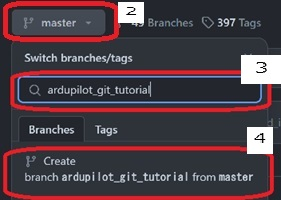

## ドローンエンジニア養成塾 Pull Request作成演習（Web版）
### 1. はじめに
   - 本演習はArduPilotプロジェクトへの貢献手段を学ぶため、練習用ファイル`Git_Success.txt` に簡単な修正をしてPull Requestを作成します。[ArduPilot WikiのGitチュートリアル](https://ardupilot.org/dev/docs/git-branch.html) をベースとしています。  
   
   - GitHubアカウントを持ってない人は、[アカウント作成手順](https://docs.github.com/ja/get-started/start-your-journey/creating-an-account-on-github) を参照して作成してください。
   - ファイル修正とGit操作（ブランチ作成、コミット、プッシュ）はGitHub Webページの機能で行います。

### 2. リポジトリのフォーク
   1. Webブラウザで[ArduPilotリポジトリ](https://github.com/ardupilot/ardupilot)にアクセスします。
   1. ページ右上の`Fork`ボタンをクリックして、リポジトリを自分のアカウントにフォークします。  
   

### 3. ワークブランチ作成
   1. フォークしたリポジトリのページ `https://github.com/＜GitHubアカウント名＞/ardupilot` に移動します。
   1. リポジトリページの上部にあるブランチのドロップダウンリストから`master`を選択します。
   1. ブランチのドロップダウンの下部にある`Find or create a branch`フィールドにワークブランチ名`ardupilot_git_tutorial` を入力します。  
   1. ボタン名が`Create branch ardupilot_git_tutorial from master`になっていることを確認してクリックします。  
   
   1. 新しく作成されたブランチ`ardupilot_git_tutorial` に切り替わっていることを確認します。  
    

<div style="page-break-before:always"></div>

### 4. ファイル変更とコミット&プッシュ
   1. フォークしたリポジトリのメインページに戻り、ブランチ`ardupilot_git_tutorial` が選択されていることを確認します。
   2. `Tools/GIT_Test/GIT_Success.txt` ファイルを開きます。
   3. キーボードの`.`をクリックします。github.dev Web ベース エディターが起動することを確認します。
   4. ファイル`GIT_Success.txt`を開き、末尾に自分の名前（firstname lastname）を追加します。
   5. `Ctrl + S`をクリックして変更を保存します。  
   6. 画面左側メニューから`ソース管理`をクリックします。  
   
   7. `GIT_Success.txt` を右クリックして、`変更のステージング`をクリックします。  
   
   8. メッセージに下記を入力して`コミットとプッシュ`ボタンをクリックします。この操作によりファイル変更がフォークしたリポジトリに反映されます。
      ```
      Tools: add name to GIT_Success.txt
      ```
      

<div style="page-break-before:always"></div>

### 5. Pull Requestの作成
   1. WebブラウザでフォークしたArduPilotリポジトリのページ `https://github.com/＜GitHubアカウント名＞/ardupilot` を開き、`Compare & pull request`ボタンをクリックします。  
   
   1. 比較するベースとなるリポジトリとブランチ、そして自分のフォークしたリポジトリとブランチを選択します。
       - **base repository**: `Ardupilot/ardupilot`
       - **base**: `master`
       - **head repository**: `＜GitHubアカウント名＞/ardupilot`
       - **compare**: `ardupilot_git_tutorial`
   1. タイトルと本文を以下のように入力します。
      ```
      Tools: add name to GIT_Success.txt
      ```
      
   1. `Create pull request`ボタンをクリックして、Pull Requestを作成します。  
      
   1. ArduPilotリポジトリの [Pull requestsタブ](https://github.com/ArduPilot/ardupilot/pulls) を開いてPull Requestが作成されていることを確認します。

### 6. ArduPilot本線の変更の取り込み
   1. フォークしたリポジトリのメインページに戻り、 ブランチ`master`を選択します。
   1. `Sync fork`ボタンをクリックします。
   1. `Update Branch`ボタンをクリックします。ArduPilot本線の最新の変更が取り込まれたことを確認します。  
   